# MOTH

**Multi-Operator Transmission Hub**

A small centralized flag intake and submission service for attack-defense CTF teams.

MOTH gives exploit scripts and teammates one simple HTTP API for handing over captured flags. Mof handles validation, duplicate detection, encrypted local storage, and eventually communication with the actual CTF submission service.

Because apparently submitting flags normally was not whimsical enough.

> MORI is watching the nest.

---

## What is MOTH?

During an attack-defense CTF, multiple exploit scripts and teammates may discover flags at the same time.

Instead of every script having to understand the competition-specific submission protocol, everything talks to MOTH.

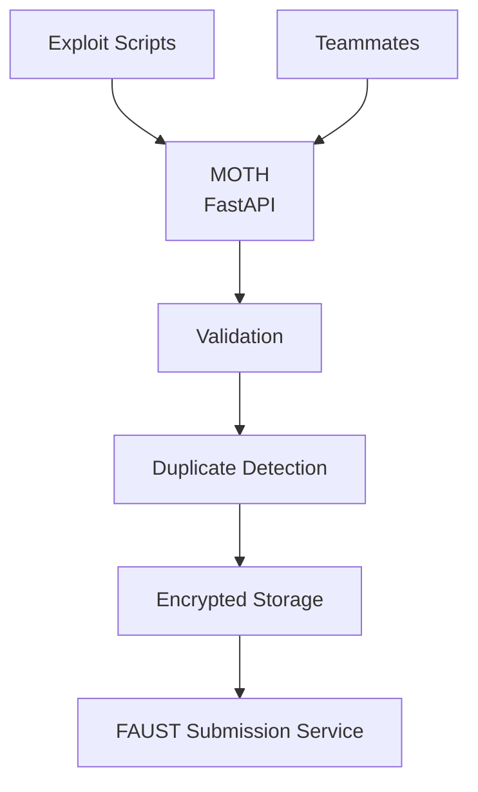

The goal is simple:

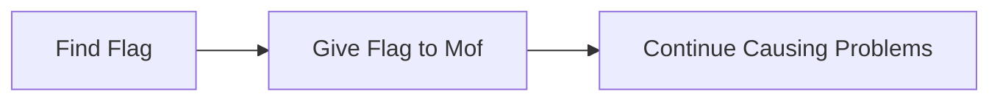

---

## Current Status

MOTH is currently under active development.

Implemented:

* FastAPI application
* health endpoint
* flag intake endpoint
* Pydantic validation
* whitespace cleanup
* empty flag rejection
* SQLite storage
* AES-256-GCM encrypted flag storage
* keyed HMAC fingerprints for duplicate detection
* duplicate submission detection
* isolated disposable test databases
* FAUST submission response parsing
* automated tests

Not implemented yet:

* TCP connection to the FAUST submission service
* submission queue
* retry handling
* API authentication
* submission status tracking
* statistics
* frontend dashboard
* excessive moth theming in the UI

The last item is considered critical infrastructure.

---

## API

### Health

```http
GET /api/health
```

Example response:

```json
{
  "status": "alive",
  "mori": "watching",
  "moth": "awake"
}
```

This confirms that Mof is awake and MORI is still watching the nest.

---

### Submit a Flag

```http
POST /api/flags
```

Example request:

```json
{
  "flag": "FAUST_EXAMPLE_FLAG",
  "service": "example-service",
  "source": "exploit-script"
}
```

A new flag currently produces:

```json
{
  "status": "stored",
  "message": "mof carried the flag into the nest"
}
```

Submitting the same flag again produces:

```json
{
  "status": "duplicate",
  "message": "mof has already seen this offering"
}
```

MOTH intentionally does not echo the submitted flag back in the response.

Mof does not need to yell secrets down the hallway.

---

## Validation

Incoming flags are validated before they are allowed into the nest.

Current behavior:

* `flag` is required
* leading and trailing whitespace is removed
* empty or whitespace-only flags are rejected
* flag length is limited
* optional `service` and `source` metadata can be supplied

Example of an unacceptable offering:

```json
{
  "flag": "     "
}
```

Mof refuses to carry an empty flag.

---

## Encrypted Storage

MOTH uses SQLite for local storage.

The database does **not** store plaintext flags.

Instead, each flag is represented by:

```text
id
flag_ciphertext
flag_nonce
flag_fingerprint
```

### Encryption

Flags are encrypted using AES-256-GCM.

Each encryption operation uses a fresh random nonce, meaning the same plaintext flag does not produce the same ciphertext twice.

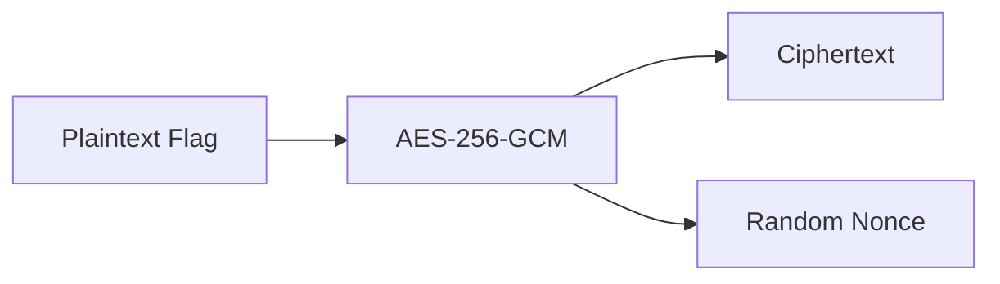

### Duplicate Detection

Duplicate detection uses a keyed HMAC-SHA256 fingerprint.

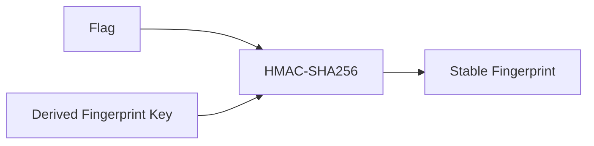

The same flag always produces the same fingerprint, allowing SQLite to detect duplicates without storing the plaintext.

A normal unkeyed SHA-256 hash is deliberately not used. A keyed fingerprint makes offline guessing harder if somebody obtains only the database.

### Key Separation

MOTH derives separate encryption and fingerprinting keys from the master database key using HKDF.

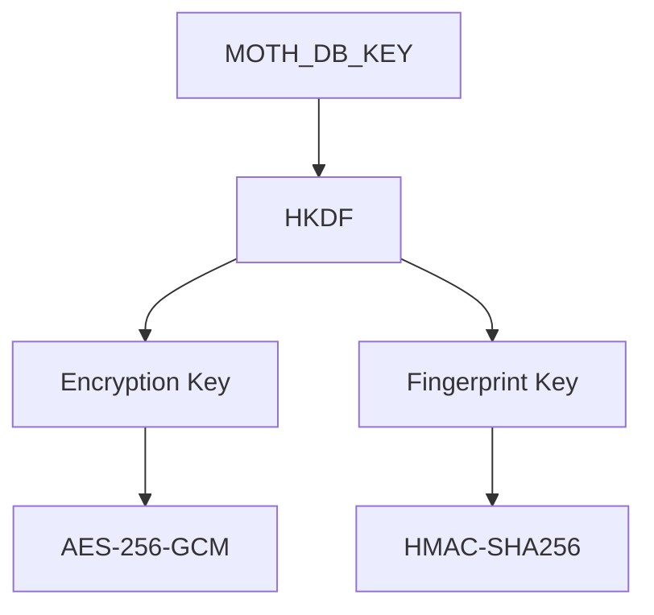

One secret, two different jobs, two derived keys.

MORI approves.

---

## Secrets

MOTH currently expects the following secret:

```text
MOTH_DB_KEY
```

It belongs in:

```text
.env
```

Example structure:

```text
MOTH_DB_KEY=your-secret-key-here
```

The `.env` file is excluded from Git.

The database itself is also excluded:

```text
.env
moth.db
```

The database key should be stored separately in a password manager or secret vault.

If the database is stolen without the key, the stored flags should remain unreadable.

If the key is lost, Mof also forgets how to read her own memories.

Choose your disaster carefully.

---

## Team Access

Teammates should **not** need `MOTH_DB_KEY`.

The intended architecture is:

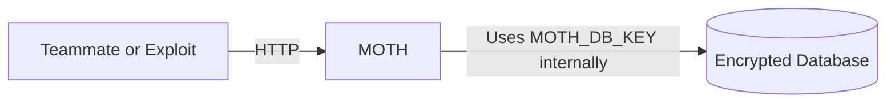

A separate API authentication secret will be added later.

Conceptually:

```text
MOTH_API_TOKEN
```

will answer:

> Who is allowed to talk to Mof?

while:

```text
MOTH_DB_KEY
```

answers:

> Who is allowed to read Mof's memories?

These are intentionally separate responsibilities.

---

## FAUST Submission Protocol

FAUST CTF uses a TCP-based flag submission protocol rather than a normal HTTP endpoint.

MOTH will sit between team tooling and that protocol.

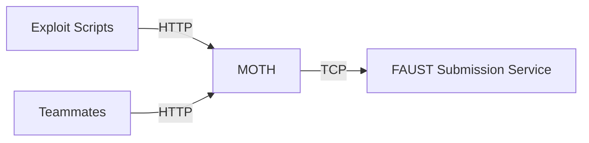

MOTH already understands the structure of submission responses.

Known response codes include:

```text
OK
DUP
OWN
OLD
INV
ERR
```

The parser also accepts previously unknown uppercase ASCII response codes.

Unknown does not mean malformed.

Mof may encounter a new species of lämp. If the response is structurally valid, she records it instead of immediately screaming into the void.

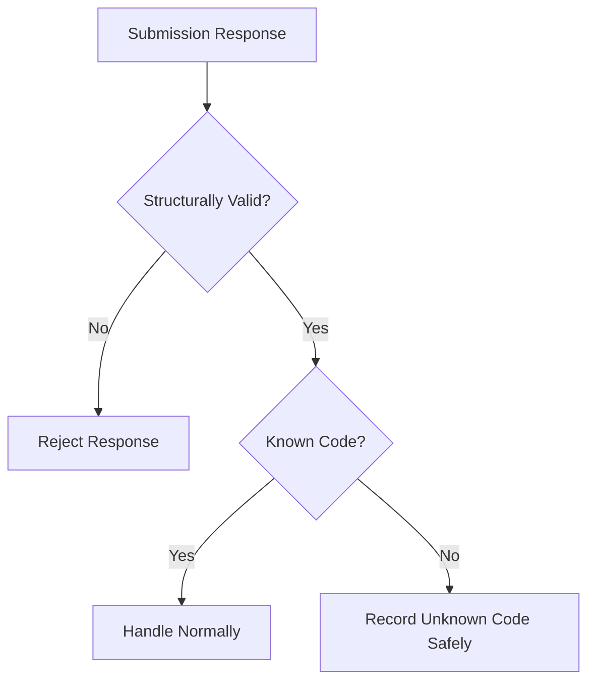

---

## Development Setup

Create a virtual environment:

```powershell
python -m venv .venv
```

Activate it:

```powershell
.\.venv\Scripts\Activate.ps1
```

Install runtime dependencies:

```powershell
python -m pip install -r requirements.txt
```

For development and testing:

```powershell
python -m pip install -r requirements-dev.txt
```

Start MOTH:

```powershell
uvicorn app.main:app --reload
```

MOTH will be available at:

```text
http://127.0.0.1:8000
```

FastAPI documentation:

```text
http://127.0.0.1:8000/docs
```

---

## Testing

Run:

```powershell
pytest -v
```

Current tests verify that:

1. Mof refuses empty flags.
2. Mof remembers duplicate flags.
3. Mof never stores plaintext flags in the SQLite database.
4. Mof understands valid FAUST submission responses.
5. Mof refuses malformed submission responses.

Current laboratory status:

```text
5 passed
```

No moths were harmed during scientific poking.

### Disposable Science Nest

Database tests never use the real `moth.db`.

Pytest creates a temporary SQLite database for each relevant test.

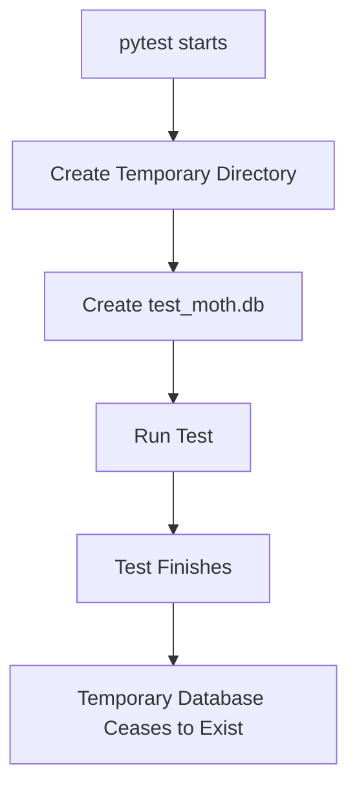

Scientific Mof gets her own disposable universe.

Production memories remain untouched.

---

## Project Structure

```text
MOTH/
|
|-- app/
|   |
|   |-- api/
|   |   |-- flags.py
|   |   `-- health.py
|   |
|   |-- core/
|   |   |-- crypto.py
|   |   `-- submitter.py
|   |
|   |-- db/
|   |   `-- database.py
|   |
|   `-- main.py
|
|-- tests/
|   |-- conftest.py
|   |-- test_flags.py
|   `-- test_submitter.py
|
|-- .gitignore
|-- pytest.ini
|-- requirements.txt
|-- requirements-dev.txt
`-- README.md
```

---

## How a Flag Moves Through MOTH

At the moment, the local intake pipeline looks like this:

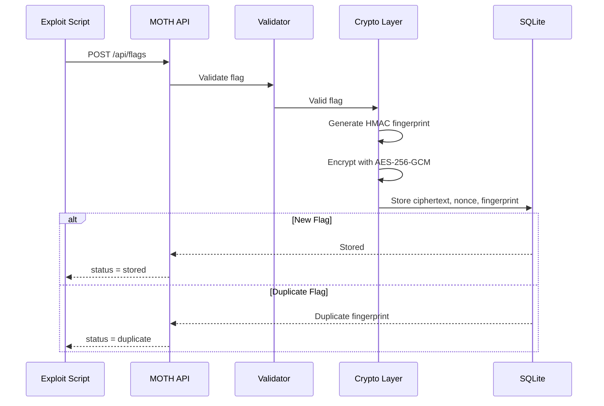

Mof accepts the offering, MORI makes it unreadable, and SQLite remembers whether she has seen it before.

---

## Mof Development Log

The Git history is considered part of the documentation.

Highlights include:

```text
mof built a tiny nest
mof discovered fastapi
mof found the api
mori started watching the nest
mof learned what a flag looks like
mof refuses suspiciously empty offerings
mof found a memory box
mori taught mof to keep secrets
mof remembers without telling secrets
mof remembers repeat visitors
mof survived scientific poking
mof got a disposable science nest
mori checked under the floorboards
mof learned gameserver dialect
```

If something breaks later, appropriate commit vocabulary includes:

```text
mof bonked into the api
mof ate the config
mof recovered from impact
mof misplaced the lämp
mof has no idea what happened
```

Technical accuracy is important.

So is maintaining proper moth incident terminology.

---

## Planned Next Steps

The next major milestone is the submission client.

MOTH needs to learn how to:

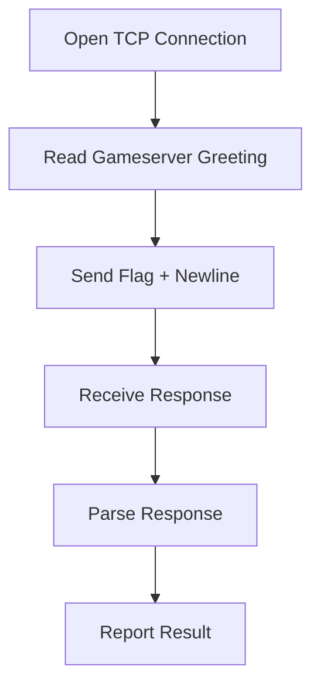

This will first be tested against mocked network connections.

Mof is not allowed to accidentally fire test flags at the real CTF infrastructure.

After that:

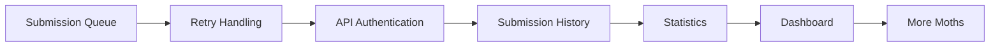

The architecture is temporary.

The moths are permanent.
