# MOTH

**Multi-Operator Transmission Hub**

```text
ཐི༏ཋྀ    ཐིཋྀ    ʚïɞ    ᖭི༏ᖫྀ

࿔‧ ֶָ֢˚˖𐦍˖˚ֶָ֢ ‧࿔

⁺‧₊˚ ཐི⋆♱⋆ཋྀ ˚₊‧⁺
```

> A small flag relay for attack-defense CTFs, supervised by MORI and operated by one increasingly capable moth.

MOTH is a lightweight FastAPI service for receiving captured flags from multiple operators or exploit scripts, authenticating clients, validating and deduplicating flags, storing them securely, and forwarding them to a CTF submission server.

The project is currently being built for FAUST CTF 2026.

MOTH is intentionally small, understandable, and boring where security matters.

The moth jokes are not considered part of the threat model.

The cat might be.

---

## Current Status

```text
𐔌՞. .՞𐦯
```

MOTH currently supports:

* FastAPI HTTP API
* Bearer-token API authentication
* constant-time API token comparison
* Pydantic request validation
* official FAUST 2026 flag-format validation
* encrypted local flag storage
* keyed duplicate detection
* local duplicate suppression
* asynchronous TCP flag submission
* FAUST-style response parsing
* configurable submission host, port, and timeout
* connection timeout handling
* response timeout handling
* connection failure handling
* distinction between retryable and terminal submission results
* retry-safe HTTP 502 handling
* retry-safe HTTP 504 handling
* pytest-based automated testing
* disposable temporary databases during tests
* full localhost end-to-end testing with a fake gameserver
* authenticated end-to-end flag submission

Current automated test status:

```text
31 passed
```

The complete authenticated local path has been manually tested:

```text
HTTP request
    ↓
MORI authentication
    ↓
FAUST flag validation
    ↓
duplicate check
    ↓
TCP submission
    ↓
fake gameserver
    ↓
submission response
    ↓
encrypted storage
    ↓
HTTP response
```

A second submission of the same flag is detected locally and does not reach the gameserver again.

Malformed flags are rejected before MOTH attempts a network connection.

Unauthorized requests are rejected before Mof processes their contents.

---

## What MOTH Is For

During an attack-defense CTF, several people and automated exploits may discover flags at the same time.

Without a central relay, every tool needs to independently handle:

* submission server connections
* authentication
* duplicate detection
* retries
* response parsing
* secrets
* logging
* submission state

MOTH provides one small service between the team and the gameserver.

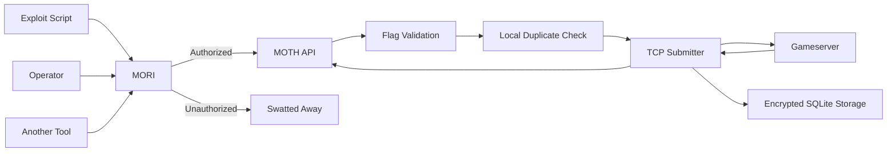

MORI guards the entrance.

Mof carries the flags.

```text
ཐི༏ཋྀ
```

---

## Architecture

MOTH currently consists of five main pieces.

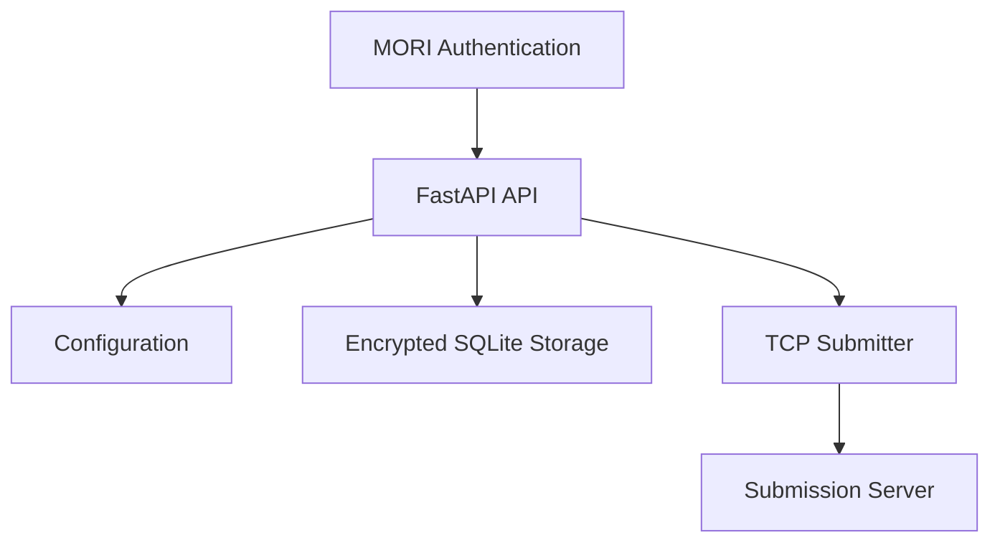

### Authentication

MORI protects the API boundary.

Clients authenticate using:

```text
Authorization: Bearer <MOTH_API_TOKEN>
```

Requests without valid credentials are rejected before the flag-handling endpoint runs.

### API

FastAPI receives flags from authenticated operators and exploit scripts.

Current endpoint:

```text
POST /api/flags
```

Example request:

```json
{
  "flag": "FAUST_AAAAAAAAAAAAAAAAAAAAAAAAAAAAAAAA",
  "service": "example-service",
  "source": "exploit-script"
}
```

`service` and `source` are currently accepted as metadata but are not yet persisted.

---

## MORI Guards the Nest

```text
/•᷅‎‎•᷄\੭
```

MORI is responsible for the API security boundary.

The authentication flow is:

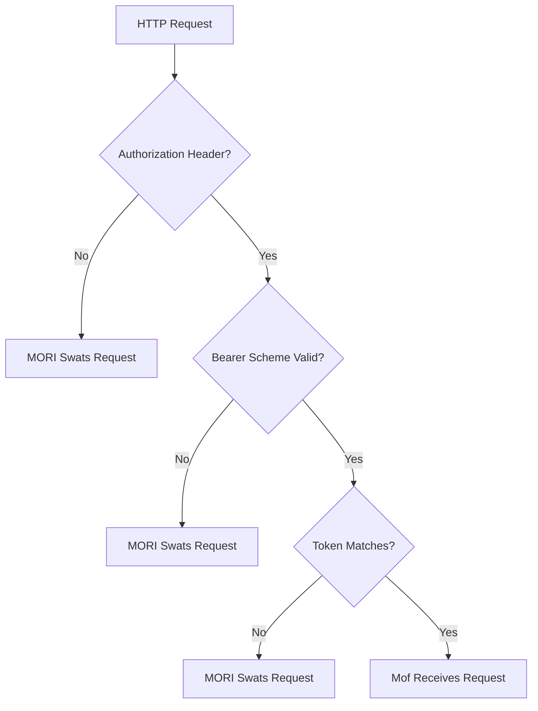

MORI currently distinguishes between several failures.

### Missing authorization

```json
{
  "detail": "MORI found no authorization at the nest entrance"
}
```

HTTP status:

```text
401 Unauthorized
```

### Malformed authorization

```json
{
  "detail": "MORI swatted away malformed authorization"
}
```

HTTP status:

```text
401 Unauthorized
```

### Unknown visitor

```json
{
  "detail": "MORI does not recognize this visitor"
}
```

HTTP status:

```text
401 Unauthorized
```

### Missing server-side API token

If the server itself is missing `MOTH_API_TOKEN`, MORI refuses to pretend the nest is guarded.

```json
{
  "detail": "MORI cannot guard the nest because MOTH_API_TOKEN is missing"
}
```

HTTP status:

```text
503 Service Unavailable
```

MORI does not fail open.

```text
/•᷅‎‎•᷄\੭   swat
```

---

## Secret Comparison

API tokens are compared using:

```python
hmac.compare_digest(...)
```

rather than ordinary string equality.

The API token and database encryption key are separate secrets with separate jobs.

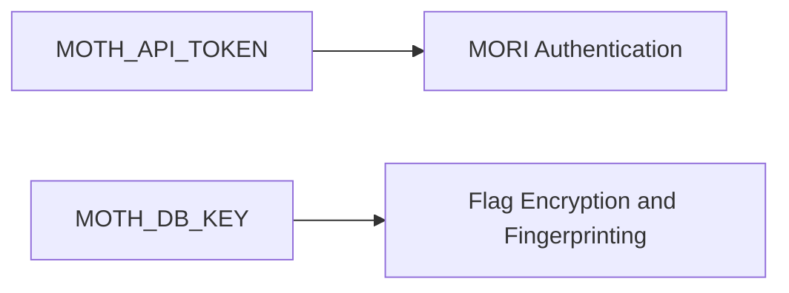

Clients may need `MOTH_API_TOKEN`.

Clients must never receive `MOTH_DB_KEY`.

---

## FAUST Flag Validation

```text
⁺‧₊˚ ཐི⋆♱⋆ཋྀ ˚₊‧⁺
```

MOTH validates incoming flags before duplicate checks or network submission.

The FAUST 2026 format is:

```text
FAUST_[A-Za-z0-9/+]{32}
```

A flag must:

* start with `FAUST_`
* contain exactly 32 characters after the prefix
* contain only letters, digits, `/`, or `+` after the prefix

MOTH uses a full regular-expression match so additional data before or after the flag is rejected.

Example valid shape:

```text
FAUST_AAAAAAAAAAAAAAAAAAAAAAAAAAAAAAAA
```

Example rejected shapes:

```text
FAUST_TOO_SHORT
MOTH_AAAAAAAAAAAAAAAAAAAAAAAAAAAAAAAA
FAUST_AAAAAAAAAAAAAAAAAAAAAAAAAAAAAAA!
```

Invalid authenticated requests are rejected by Pydantic with HTTP `422`.

They never reach the TCP submission layer.

Unauthorized requests are rejected by MORI before flag validation occurs.

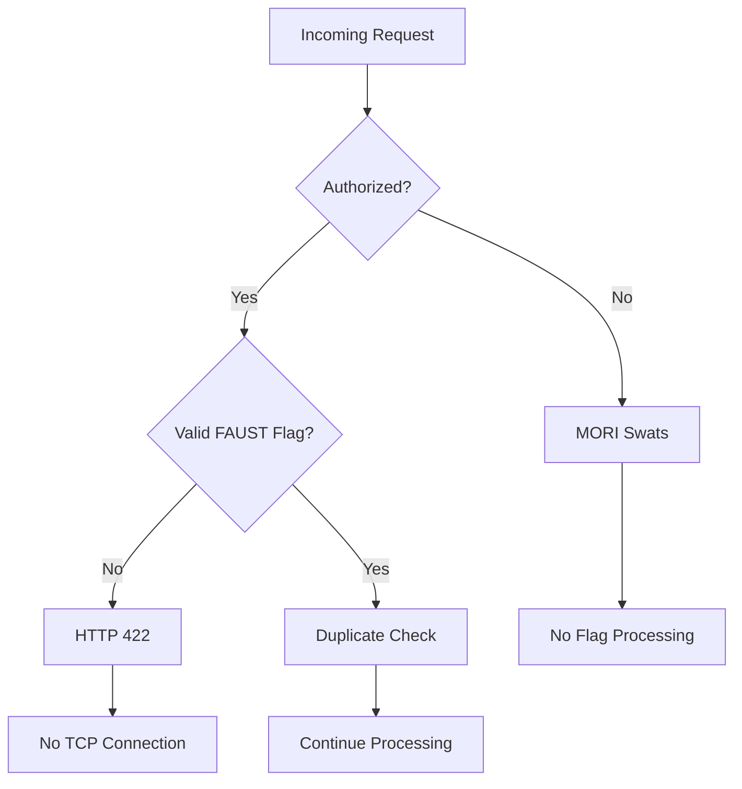

---

## Flag Processing

A valid authenticated flag currently moves through MOTH like this:

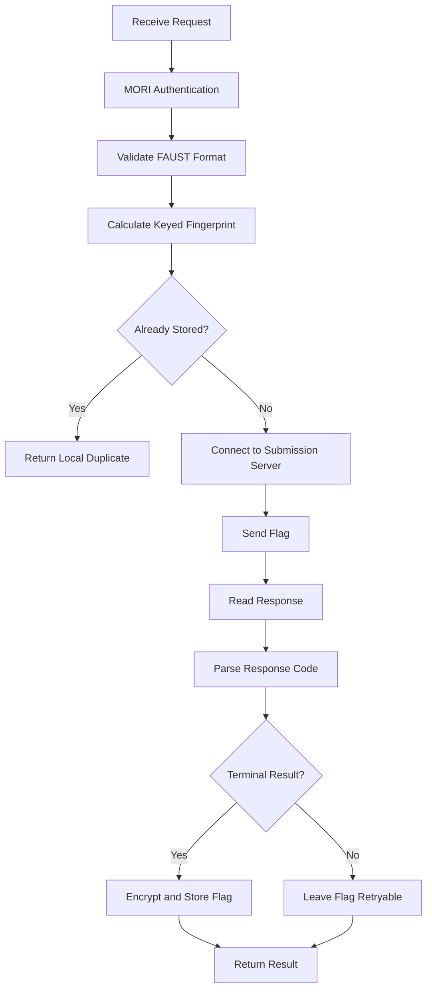

MOTH does not permanently remember a flag before attempting submission.

If the submission server cannot be reached, the flag remains eligible for another attempt.

---

## Duplicate Detection

MOTH does not need to decrypt every stored flag to determine whether a new flag has already been seen.

Instead, every flag receives a deterministic keyed fingerprint.

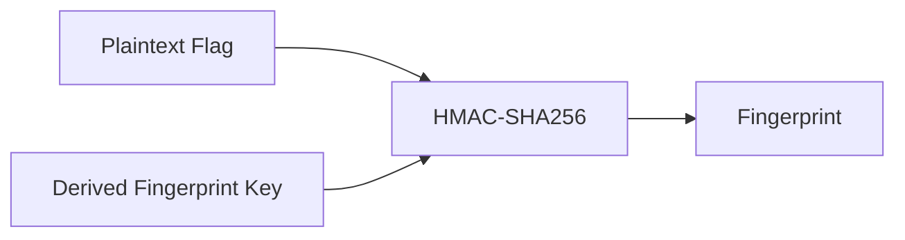

The fingerprint is stored in SQLite with a `UNIQUE` constraint.

This allows MOTH to efficiently answer:

> Have I seen this offering before?

without storing the plaintext flag.

Because the fingerprint uses HMAC with a secret key, a database-only attacker cannot directly perform the same offline guessing attacks that would be possible against ordinary unkeyed hashes.

---

## Encrypted Storage

```text
ʚïɞ
```

Flags are encrypted before being written to SQLite.

MOTH currently uses:

* AES-256-GCM
* random 12-byte nonces
* a 256-bit master key
* HKDF-SHA256 for key separation
* HMAC-SHA256 for duplicate fingerprints

The database stores:

```text
id
flag_ciphertext
flag_nonce
flag_fingerprint
```

It does not intentionally store plaintext flags.

The plaintext absence is also covered by an automated test.

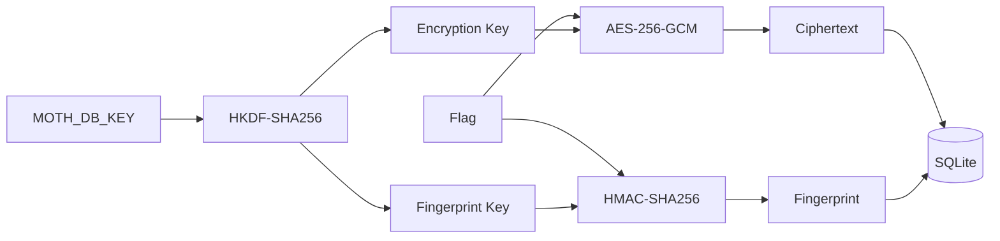

---

## Key Separation

MOTH uses one database master secret but derives separate keys for separate cryptographic purposes.

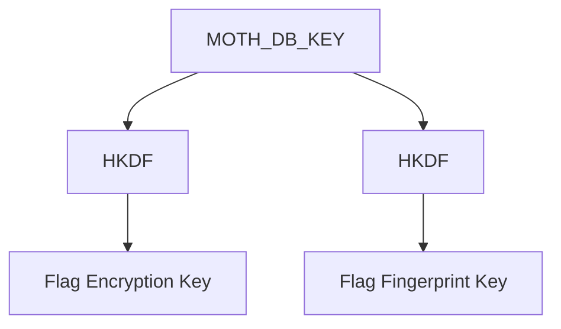

The encryption key is never reused directly as the fingerprint key.

The API authentication token is not derived from this master key.

It is a separate secret.

---

## Secrets

MOTH currently uses two important secrets.

### Database master key

```text
MOTH_DB_KEY
```

This secret:

* must decode to exactly 32 bytes
* remains on the MOTH server
* derives encryption and fingerprint keys
* must never be given to API clients

### API token

```text
MOTH_API_TOKEN
```

This secret:

* authenticates clients
* is supplied as a Bearer token
* is independent of `MOTH_DB_KEY`
* should be randomly generated
* must not be committed to Git

Local development secrets may be stored in `.env`.

`.env` is excluded from Git.

Never commit either secret.

---

## Submission Configuration

The TCP submitter is configured through environment variables.

```text
MOTH_SUBMISSION_HOST
MOTH_SUBMISSION_PORT
MOTH_SUBMISSION_TIMEOUT
```

Safe development defaults are:

```text
MOTH_SUBMISSION_HOST=127.0.0.1
MOTH_SUBMISSION_PORT=6666
MOTH_SUBMISSION_TIMEOUT=5.0
```

The localhost default is deliberate.

Running MOTH without submission configuration should not accidentally send anything to external infrastructure.

During development, the submitter is pointed at a local fake gameserver.

---

## Submission Client

```text
ᖭི༏ᖫྀ
```

The submission client uses Python's asynchronous networking support.

Its basic flow is:

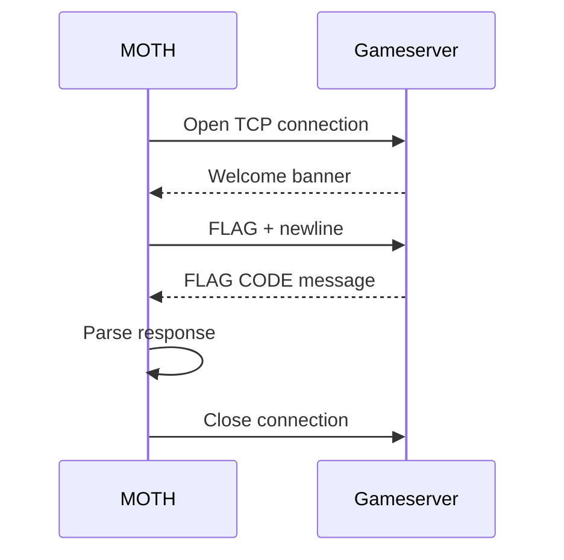

A submission response is represented internally as:

```python
SubmissionResult(
    flag="...",
    code="OK",
    message="accepted",
)
```

MOTH validates the structure of the response separately from the meaning of the response code.

Uppercase ASCII response codes are accepted structurally so that a future gameserver response code does not automatically break the parser.

---

## Submission Results

Known terminal response codes currently include:

```text
OK
DUP
OWN
OLD
INV
```

Terminal results cause MOTH to remember the flag locally.

A gameserver error such as:

```text
ERR
```

does not cause the flag to be permanently remembered, allowing it to be retried later.

Unknown response codes are also not automatically treated as terminal.

This keeps MOTH conservative when the gameserver says something she does not understand.

New species of lämp require observation before classification.

---

## Network Failure Handling

### Connection could not be established

Possible internal errors include:

```text
mof flew toward the lämp, but there was no lämp
```

or:

```text
mof flew toward the lämp, but could not find it
```

The API converts submission connection failures into:

```text
HTTP 502 Bad Gateway
```

The flag is not remembered.

This has been manually verified end to end.

After a `502`, restarting the fake gameserver and submitting the same flag again successfully sends the flag.

### Connection exists but the server stops responding

Example internal error:

```text
mof waited for the lämp, but it never answered
```

The API converts submission timeouts into:

```text
HTTP 504 Gateway Timeout
```

The flag is not remembered.

This has also been manually verified end to end.

After a `504`, replacing the silent server with a working fake gameserver and submitting the same flag again succeeds.

### Connection disappears unexpectedly

MOTH detects when a server closes the connection before returning a submission response.

The TCP writer is closed in cleanup code even when submission fails.

Mof does not leave abandoned sockets lying around the nest.

```text
𐔌՞. .՞𐦯
```

---

## API Responses

### Successful submission

```json
{
  "status": "submitted",
  "code": "OK",
  "message": "accepted",
  "remembered": true
}
```

### Local duplicate

```json
{
  "status": "duplicate",
  "code": "LOCAL",
  "message": "mof has already seen this offering",
  "remembered": true
}
```

A locally detected duplicate never reaches the submission server again.

### Retryable gameserver result

```json
{
  "status": "submitted",
  "code": "ERR",
  "message": "try again later",
  "remembered": false
}
```

The flag remains eligible for another submission attempt.

---

## Development Setup

Create a virtual environment:

```powershell
python -m venv .venv
```

Activate it:

```powershell
.\.venv\Scripts\Activate.ps1
```

Install development dependencies:

```powershell
pip install -r requirements-dev.txt
```

Generate a random API token:

```powershell
python -c "import secrets; print(secrets.token_urlsafe(32))"
```

Create a local `.env`.

Example:

```text
MOTH_DB_KEY=<your-database-key>
MOTH_API_TOKEN=<your-api-token>

MOTH_SUBMISSION_HOST=127.0.0.1
MOTH_SUBMISSION_PORT=6666
MOTH_SUBMISSION_TIMEOUT=2.0
```

Do not copy secrets from documentation or another installation.

Generate your own.

---

## Running MOTH

Start the development server with:

```powershell
uvicorn app.main:app --reload
```

The API is then available locally at:

```text
http://127.0.0.1:8000
```

FastAPI's interactive API documentation is available at:

```text
http://127.0.0.1:8000/docs
```

Authenticated requests require:

```text
Authorization: Bearer <MOTH_API_TOKEN>
```

---

## Example Authenticated Request

PowerShell example:

```powershell
$token = (
    Get-Content .env |
    Where-Object { $_ -like "MOTH_API_TOKEN=*" }
).Split("=", 2)[1]

$body = @{
    flag = "FAUST_AAAAAAAAAAAAAAAAAAAAAAAAAAAAAAAA"
    service = "example"
    source = "manual"
} | ConvertTo-Json

Invoke-RestMethod `
    -Uri "http://127.0.0.1:8000/api/flags" `
    -Method Post `
    -ContentType "application/json" `
    -Headers @{
        Authorization = "Bearer $token"
    } `
    -Body $body
```

The example loads the token from `.env` rather than placing the secret directly into the command.

---

## Testing

```text
࿔‧ ֶָ֢˚˖𐦍˖˚ֶָ֢ ‧࿔
```

Run the complete test suite with:

```powershell
pytest -v
```

The current suite covers:

* empty flag rejection
* valid FAUST flag acceptance
* short malformed flag rejection
* incorrect flag prefix rejection
* invalid flag character rejection
* duplicate detection
* keyed flag memory checks
* absence of plaintext flags in SQLite
* response parsing
* malformed response rejection
* fake TCP submission
* socket cleanup
* silent server timeout
* connection failure
* connection establishment timeout
* safe localhost configuration defaults
* environment submission configuration
* invalid port handling
* invalid timeout handling
* API token configuration
* missing API token handling
* missing authorization rejection
* malformed authorization rejection
* incorrect Bearer token rejection
* valid Bearer token acceptance
* authentication before flag validation
* fail-closed behavior when API authentication is unconfigured
* successful API submission
* local duplicate suppression
* retryable gameserver errors
* HTTP 502 translation
* HTTP 504 translation

Current status:

```text
31 passed
```

---

## Authentication Tests

MORI's behavior is explicitly tested.

```text
no Authorization header
→ 401
→ MORI swats

malformed Authorization header
→ 401
→ MORI swats

wrong Bearer token
→ 401
→ MORI swats

correct Bearer token
→ request enters Mof's processing path

no server-side MOTH_API_TOKEN
→ 503
→ MORI refuses to pretend the nest is guarded
```

One test deliberately sends both:

```text
unauthorized request
+
invalid flag
```

The result is `401`, not `422`.

This proves authentication happens before Mof examines the flag.

```text
/•᷅‎‎•᷄\੭
```

---

## Disposable Science Nest

Database tests do not use the normal development database.

Pytest creates a temporary database using:

```text
tmp_path
```

The application's database path is redirected for the duration of the test.

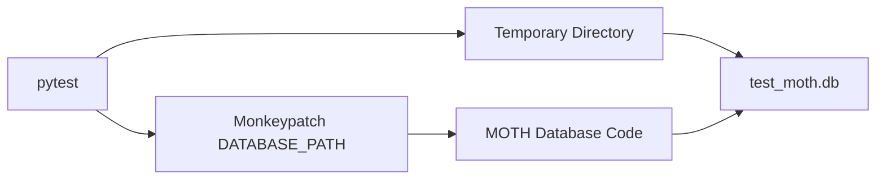

This allows tests to freely insert flags, create duplicates, and inspect raw database bytes without contaminating the normal MOTH database.

When the test finishes, pytest cleans up the temporary nest.

---

## Manual End-to-End Testing

MOTH has been manually tested against local fake gameservers.

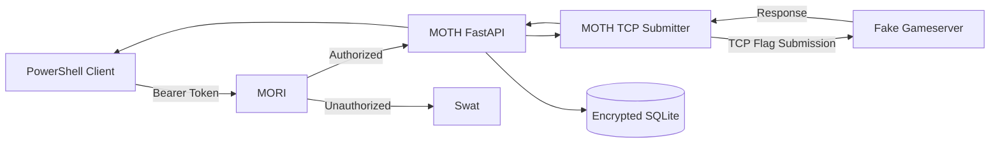

### Successful authenticated submission

A valid-shaped flag was submitted with the correct Bearer token through the entire stack.

The fake gameserver received:

```text
FAUST_ZZZZZZZZZZZZZZZZZZZZZZZZZZZZZZZZ
```

and returned `OK`.

MOTH remembered the flag.

### Missing authentication

A valid flag submitted without an Authorization header was rejected with:

```text
MORI found no authorization at the nest entrance
```

The request never reached flag processing.

### Incorrect authentication

A request using an incorrect Bearer token was rejected with:

```text
MORI does not recognize this visitor
```

The request never reached Mof.

### Authorized malformed flag

A request using the correct token but containing:

```text
absolutely-not-a-faust-flag
```

passed MORI and was then rejected by Mof's FAUST format validation.

This manually confirms the boundary order:

```text
MORI
↓
Mof
↓
TCP
```

### Missing gameserver

A fresh flag was submitted while the fake gameserver was offline.

MOTH returned HTTP `502`.

After restarting the gameserver, submitting the same flag succeeded.

The failed attempt had not been remembered.

### Silent gameserver

A fake gameserver accepted the TCP connection but deliberately stopped responding.

MOTH returned HTTP `504`.

After replacing it with the normal fake gameserver, submitting the same flag succeeded.

The timed-out attempt had not been remembered.

---

## Project Structure

```text
MOTH/
├── README.md
├── app/
│   ├── __init__.py
│   ├── main.py
│   ├── api/
│   │   ├── __init__.py
│   │   ├── health.py
│   │   └── flags.py
│   ├── core/
│   │   ├── __init__.py
│   │   ├── auth.py
│   │   ├── config.py
│   │   ├── crypto.py
│   │   └── submitter.py
│   └── db/
│       ├── __init__.py
│       └── database.py
├── tests/
│   ├── conftest.py
│   ├── test_auth.py
│   ├── test_config.py
│   ├── test_flags.py
│   └── test_submitter.py
├── .gitignore
├── pytest.ini
├── requirements.txt
└── requirements-dev.txt
```

---

## Security Model

```text
/•᷅‎‎•᷄\੭
```

MOTH currently protects two different boundaries.

### API boundary

MORI requires a Bearer token before requests enter Mof's flag-processing path.

This prevents arbitrary unauthenticated clients from submitting flags through the API.

### Database boundary

Application-layer encryption protects stored flag contents if the SQLite database alone is copied or leaked.

It does not hide all database metadata.

An observer with access to the database may still learn information such as:

* number of stored flags
* row identifiers
* ciphertext sizes
* fingerprints
* database schema

An attacker with full access to the MOTH host, process memory, environment, or `.env` file may be able to recover both server secrets.

MOTH therefore does not treat authentication or application-layer database encryption as replacements for host security.

The current design is defense in depth.

MORI remains suspicious.

```text
/•᷅‎‎•᷄\੭
```

---

## Current Trust Boundary

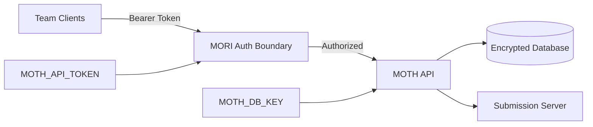

`MOTH_API_TOKEN` authenticates clients.

`MOTH_DB_KEY` protects stored flag material.

They are deliberately separate secrets.

Bearer-token authentication does not encrypt network traffic.

MOTH should therefore still be deployed only across trusted transport, such as:

* localhost
* a protected team network
* a VPN
* TLS-terminated infrastructure

The API should not be exposed directly over an untrusted plaintext network merely because it now has a Bearer token.

MORI has a paw, not a TLS certificate.

---

## Nest Residents

```text
ཐི༏ཋྀ
ཐིཋྀ
࿔‧ ֶָ֢˚˖𐦍˖˚ֶָ֢ ‧࿔
𐔌՞. .՞𐦯
⁺‧₊˚ ཐི⋆♱⋆ཋྀ ˚₊‧⁺
ʚïɞ
ᖭི༏ᖫྀ

/•᷅‎‎•᷄\੭
```

Classification remains disputed.

All moths appear to be authorized.

MORI checked.

---

## Planned Work

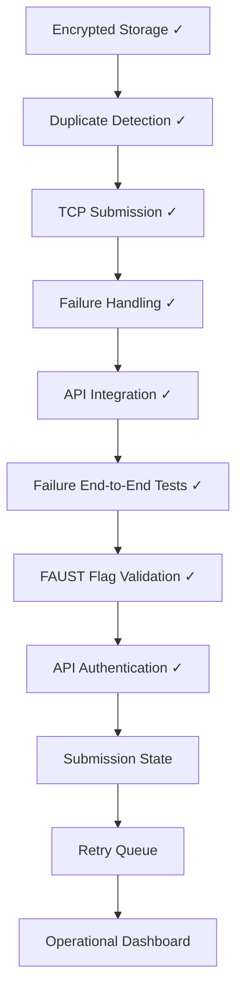

### Near Term

Planned next steps include:

* design persistent submission state
* distinguish queued, submitted, terminal, and retryable flags
* design retry behavior
* persist response metadata
* persist timestamps
* decide how `service` and `source` metadata should be stored
* add concurrency-safe submission handling

### Later

Possible later additions include:

* retry queue
* submission history
* concurrent workers
* structured logging
* metrics
* dashboard
* operator view
* rate limiting
* token rotation
* multiple client tokens
* per-client identity
* health information for the submission backend

---

## Mof Development Log

MOTH has been built in deliberately small checkpoints.

Notable discoveries so far:

```text
mof built a tiny nest
mof discovered fastapi
mof found the api
mori started watching the nest
mof learned what a flag looks like
mof refuses suspiciously empty offerings
mof found a memory box
mori taught mof to keep secrets
mof remembers without telling secrets
mof remembers repeat visitors
mof survived scientific poking
mof got a disposable science nest
mori checked under the floorboards
mof learned gameserver dialect
mof learned to speak tcp
mof learned when to stop staring at the lämp
mof learned the difference between silence and absence
mof learned where the lämp lives
mof learned to check the nest first
mof carried her first flag through the whole nest
mof learned what a real flag looks like
mori started guarding the nest
```

More incidents are expected.

---

## Why MOTH?

Because every attack-defense team eventually creates some cursed little script that forwards flags.

This one gets tests.

And a cat.

```text
⁺‧₊˚ ཐི⋆♱⋆ཋྀ ˚₊‧⁺

      lämp acquired

/•᷅‎‎•᷄\੭
```
