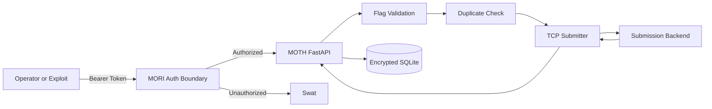
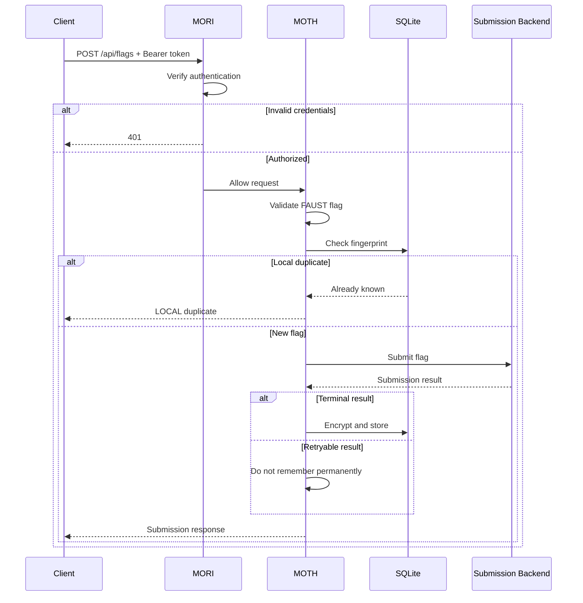
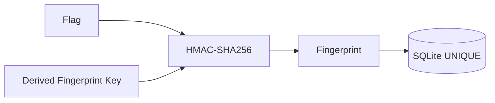
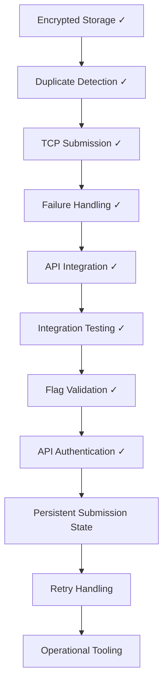

# MOTH

**Multi-Operator Transmission Hub**

```text
ཐི༏ཋྀ    ཐིཋྀ    ʚïɞ    ᖭི༏ᖫྀ

࿔‧ ֶָ֢˚˖𐦍˖˚ֶָ֢ ‧࿔

⁺‧₊˚ ཐི⋆♱⋆ཋྀ ˚₊‧⁺
```

> Internal TTZ team documentation for the FAUST CTF flag relay.

MOTH is a lightweight authenticated FastAPI service that accepts captured FAUST flags from operators and exploit scripts, validates and deduplicates them, forwards them to the submission backend, and stores terminal results locally using encrypted storage.

MORI guards the entrance.

Mof carries the flags.

```text
/•᷅‎‎•᷄\੭       ཐི༏ཋྀ
 security        delivery
```

---

## Repository Status

This TTZ repository is the **active private development repository**.

The public GitHub repository represents a sanitized pre-competition snapshot.

```text
TTZ private Git
└── active development
    ├── competition features
    ├── internal documentation
    ├── operational notes
    └── future deployment configuration

Public GitHub
└── sanitized snapshot
```

Do not push private competition changes to `origin` unless that publication is intentional.

Normal development pushes should target:

```text
ttz/main
```

The local `main` branch is configured to use the TTZ remote for normal pushes.

---

## Current Status

MOTH currently supports:

* FastAPI HTTP API
* Bearer-token API authentication
* fail-closed authentication
* constant-time token comparison
* Pydantic input validation
* FAUST flag-format validation
* keyed duplicate detection
* encrypted SQLite flag storage
* AES-256-GCM flag encryption
* HMAC-SHA256 fingerprints
* HKDF-SHA256 key separation
* asynchronous TCP submission
* configurable submission backend
* configurable timeout
* connection failure handling
* response timeout handling
* retry-safe transient failures
* terminal versus retryable result handling
* local duplicate suppression
* disposable test databases
* automated unit and integration tests
* manual local end-to-end verification

Current automated test status:

```text
31 passed
```

Two dependency deprecation warnings currently originate from the FastAPI, Starlette, HTTPX, and AnyIO testing stack.

They are not MOTH test failures.

---

## Architecture


```mermaid
flowchart LR
    CLIENT[Operator or Exploit]

    MORI[MORI Auth Boundary]
    API[MOTH FastAPI]
    VALIDATE[Flag Validation]
    DEDUP[Duplicate Check]
    SUBMIT[TCP Submitter]
    BACKEND[Submission Backend]
    DB[(Encrypted SQLite)]

    CLIENT -->|Bearer Token| MORI
    MORI -->|Authorized| API
    MORI -->|Unauthorized| SWAT[Swat]

    API --> VALIDATE
    VALIDATE --> DEDUP
    DEDUP --> SUBMIT
    SUBMIT --> BACKEND

    BACKEND --> SUBMIT
    SUBMIT --> API
    API --> DB
```

---

## Request Flow


```mermaid
sequenceDiagram
    participant C as Client
    participant M as MORI
    participant API as MOTH
    participant DB as SQLite
    participant G as Submission Backend

    C->>M: POST /api/flags + Bearer token
    M->>M: Verify authentication

    alt Invalid credentials
        M-->>C: 401
    else Authorized
        M->>API: Allow request
        API->>API: Validate FAUST flag
        API->>DB: Check fingerprint

        alt Local duplicate
            DB-->>API: Already known
            API-->>C: LOCAL duplicate
        else New flag
            API->>G: Submit flag
            G-->>API: Submission result

            alt Terminal result
                API->>DB: Encrypt and store
            else Retryable result
                API->>API: Do not remember permanently
            end

            API-->>C: Submission response
        end
    end
```

---

## MORI Authentication

```text
/•᷅‎‎•᷄\੭
```

MORI owns the API security boundary.

Clients authenticate using:

```text
Authorization: Bearer <MOTH_API_TOKEN>
```

Authentication happens before flag processing.

### Missing credentials

Returns:

```text
401 Unauthorized
```

with:

```text
MORI found no authorization at the nest entrance
```

### Malformed credentials

Returns:

```text
401 Unauthorized
```

with:

```text
MORI swatted away malformed authorization
```

### Wrong token

Returns:

```text
401 Unauthorized
```

with:

```text
MORI does not recognize this visitor
```

### Missing server-side authentication configuration

If `MOTH_API_TOKEN` is not configured on the server, MORI fails closed.

Returns:

```text
503 Service Unavailable
```

MORI does not pretend the nest is guarded when it is not.

---

## Flag Validation

Supported FAUST flag shape:

```text
FAUST_[A-Za-z0-9/+]{32}
```

Example valid flag shape:

```text
FAUST_AAAAAAAAAAAAAAAAAAAAAAAAAAAAAAAA
```

Authenticated malformed flags are rejected before database or network submission.

Example:

```text
mof does not recognize this as a FAUST flag
```

---

## Duplicate Detection

MOTH does not store plaintext flags for duplicate comparison.

Instead:


```mermaid
flowchart LR
    FLAG[Flag]
    KEY[Derived Fingerprint Key]

    FLAG --> HMAC[HMAC-SHA256]
    KEY --> HMAC

    HMAC --> FP[Fingerprint]
    FP --> DB[(SQLite UNIQUE)]
```

The fingerprint is deterministic for the same flag and key.

A local duplicate is stopped before another submission request is sent.

Example response:

```json
{
  "status": "duplicate",
  "code": "LOCAL",
  "message": "mof has already seen this offering",
  "remembered": true
}
```

---

## Encrypted Storage

Flags are encrypted before storage.

Current design:

```text
MOTH_DB_KEY
    ↓
HKDF-SHA256
    ├── encryption key
    └── fingerprint key
```

Flag encryption:

```text
AES-256-GCM
```

Nonce:

```text
12 random bytes
```

Fingerprinting:

```text
HMAC-SHA256
```

SQLite currently stores:

```text
id
flag_ciphertext
flag_nonce
flag_fingerprint
```

Plaintext flags are not intentionally stored.

Automated testing verifies that submitted plaintext is absent from the raw database bytes.

---

## Secrets

MOTH currently uses two primary secrets.

### `MOTH_DB_KEY`

Used for:

* encryption
* fingerprint derivation

This remains server-side.

Clients must never receive it.

### `MOTH_API_TOKEN`

Used for:

* client authentication

This token may be shared with authorized team clients.

It is independent of the database key.

### Rules

Never commit:

```text
.env
MOTH_DB_KEY
MOTH_API_TOKEN
private SSH keys
competition credentials
```

Private Git is not a secret manager.

MORI will swat accordingly.

---

## Submission Backend

Submission configuration is controlled through:

```text
MOTH_SUBMISSION_HOST
MOTH_SUBMISSION_PORT
MOTH_SUBMISSION_TIMEOUT
```

Local development defaults remain intentionally safe.

```text
host:    127.0.0.1
port:    6666
timeout: 5.0 seconds
```

Final competition deployment values must be stored outside Git.

### Competition configuration

```text
TODO: Final MOTH host
TODO: Final submission backend host
TODO: Final submission backend port
TODO: Final network route
TODO: Final startup method
```

Do not fill these values with guesses.

Update them when the team deployment is actually decided.

---

## Submission Results

Terminal results currently include:

```text
OK
DUP
OWN
OLD
INV
```

These cause the flag to be remembered locally.

Retryable result:

```text
ERR
```

does not cause permanent local memory.

Unknown structurally valid response codes are treated conservatively and are not automatically considered terminal.

---

## Failure Handling

### Backend unavailable

MOTH returns:

```text
502 Bad Gateway
```

The flag is not remembered.

A later retry remains possible.

### Backend connected but silent

MOTH returns:

```text
504 Gateway Timeout
```

The flag is not remembered.

### Local duplicate

The gameserver is not contacted again.

---

## Manual Verification Completed

The following paths have been manually tested locally:

* successful authenticated flag submission
* unauthorized request rejection
* wrong-token rejection
* authenticated malformed flag rejection
* local duplicate suppression
* missing backend resulting in `502`
* retry after `502`
* silent backend resulting in `504`
* retry after `504`
* complete HTTP to TCP to encrypted-storage path

---

## Development

Create the virtual environment:

```powershell
python -m venv .venv
```

Activate:

```powershell
.\.venv\Scripts\Activate.ps1
```

Install dependencies:

```powershell
pip install -r requirements-dev.txt
```

Run MOTH:

```powershell
uvicorn app.main:app --reload
```

Run tests:

```powershell
pytest -v
```

---

## Git Workflow

Primary development remote:

```text
ttz
```

Public snapshot remote:

```text
origin
```

Normal development:

```powershell
git status
git add .
git commit -m "mof learned something questionable"
git push
```

`git push` should target `ttz/main`.

Do not push to:

```powershell
git push origin main
```

unless publishing the private development state is intentional.

---

## Commit Signing

New commits in this repository are configured for SSH signing.

Configuration:

```text
gpg.format = ssh
commit.gpgsign = true
```

Signing key:

```text
~/.ssh/id_ed25519_ttz_signing.pub
```

The private key must never be committed or shared.

Future commits should appear as verified in TTZ GitLab when the signing key and commit email are correctly associated with the account.

---

## Project Structure

```text
MOTH/
├── README.md
├── docs/
│   └── USAGE.md
├── app/
│   ├── __init__.py
│   ├── main.py
│   ├── api/
│   │   ├── __init__.py
│   │   ├── health.py
│   │   └── flags.py
│   ├── core/
│   │   ├── __init__.py
│   │   ├── auth.py
│   │   ├── config.py
│   │   ├── crypto.py
│   │   └── submitter.py
│   └── db/
│       ├── __init__.py
│       └── database.py
├── tests/
│   ├── conftest.py
│   ├── test_auth.py
│   ├── test_config.py
│   ├── test_flags.py
│   └── test_submitter.py
├── .gitignore
├── pytest.ini
├── requirements.txt
└── requirements-dev.txt
```

---

## Deployment Security

Bearer authentication does not provide transport encryption.

For competition use, MOTH must run over appropriately trusted or protected transport.

Possible approaches include:

* protected team network
* VPN
* TLS termination
* local service boundaries

Final deployment design is still pending.

Do not expose the API directly over an untrusted plaintext network merely because MORI checks tokens.

```text
/•᷅‎‎•᷄\੭

MORI has claws.
MORI does not provide TLS.
```

---

## Planned Work


```mermaid
flowchart TD
    A[Encrypted Storage ✓]
    B[Duplicate Detection ✓]
    C[TCP Submission ✓]
    D[Failure Handling ✓]
    E[API Integration ✓]
    F[Integration Testing ✓]
    G[Flag Validation ✓]
    H[API Authentication ✓]
    I[Persistent Submission State]
    J[Retry Handling]
    K[Operational Tooling]

    A --> B
    B --> C
    C --> D
    D --> E
    E --> F
    F --> G
    G --> H
    H --> I
    I --> J
    J --> K
```

Near-term development:

* persistent submission state
* timestamps
* response metadata
* `service` metadata persistence
* `source` metadata persistence
* concurrency-safe handling
* retry queue design
* structured logging

---

## Nest Residents

```text
ཐི༏ཋྀ
ཐིཋྀ
࿔‧ ֶָ֢˚˖𐦍˖˚ֶָ֢ ‧࿔
𐔌՞. .՞𐦯
⁺‧₊˚ ཐི⋆♱⋆ཋྀ ˚₊‧⁺
ʚïɞ
ᖭི༏ᖫྀ

/•᷅‎‎•᷄\੭
```

Mof carries flags.

MORI checks visitors.

Classification of the other residents remains disputed.

---

## Development Log

```text
mof built a tiny nest
mof discovered fastapi
mof found the api
mori started watching the nest
mof learned what a flag looks like
mof refuses suspiciously empty offerings
mof found a memory box
mori taught mof to keep secrets
mof remembers without telling secrets
mof remembers repeat visitors
mof survived scientific poking
mof got a disposable science nest
mori checked under the floorboards
mof learned gameserver dialect
mof learned to speak tcp
mof learned when to stop staring at the lämp
mof learned the difference between silence and absence
mof learned where the lämp lives
mof learned to check the nest first
mof carried her first flag through the whole nest
mof learned what a real flag looks like
mori started guarding the nest
mori wrote the visitor guide
```

More incidents are expected.

---

## Why MOTH?

Because every attack-defense team eventually creates some cursed little script that forwards flags.

This one gets:

* tests
* encryption
* authentication
* signed commits
* documentation
* a moth
* a cat with anger-management issues

```text
⁺‧₊˚ ཐི⋆♱⋆ཋྀ ˚₊‧⁺

      lämp acquired

/•᷅‎‎•᷄\੭
```
