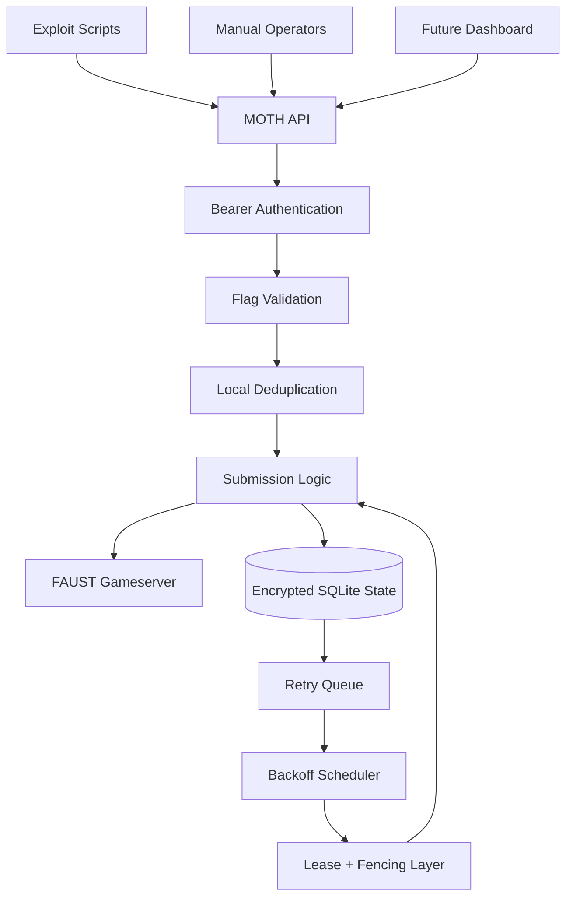
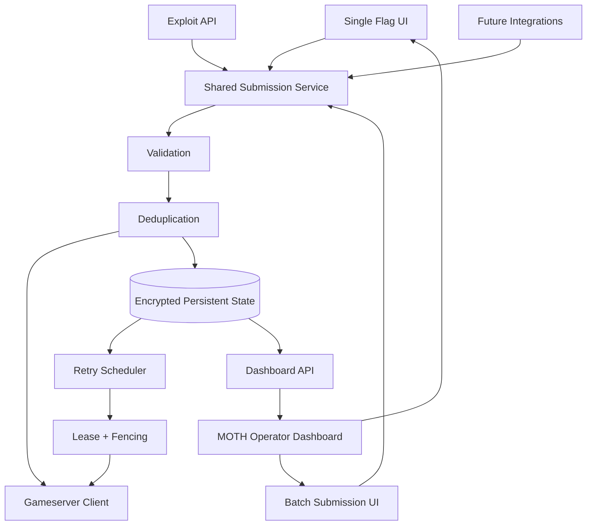
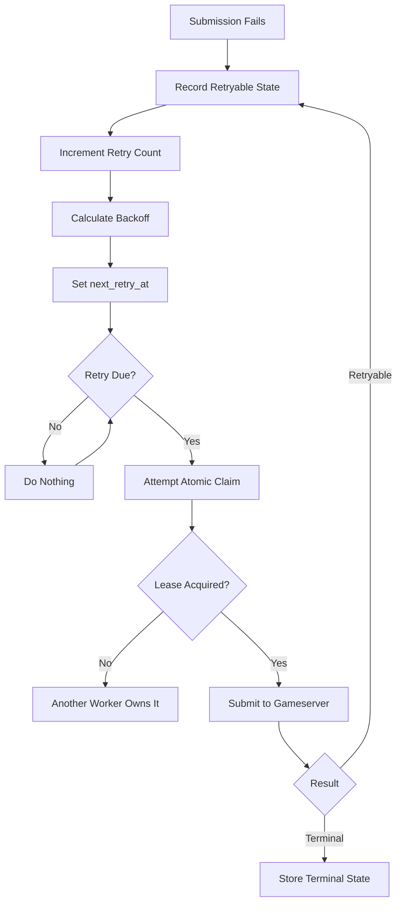
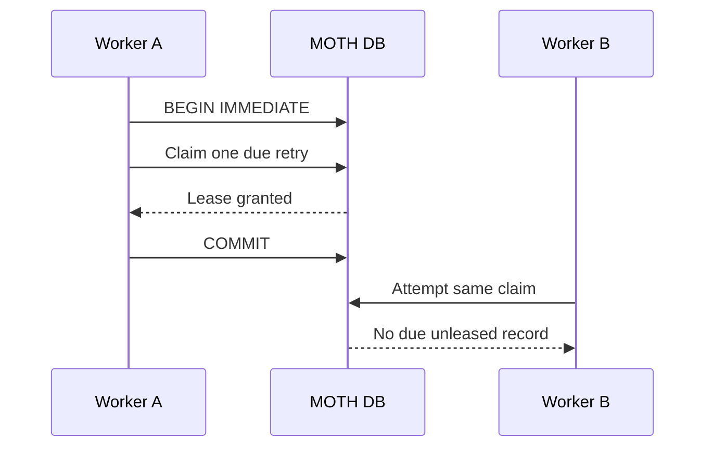
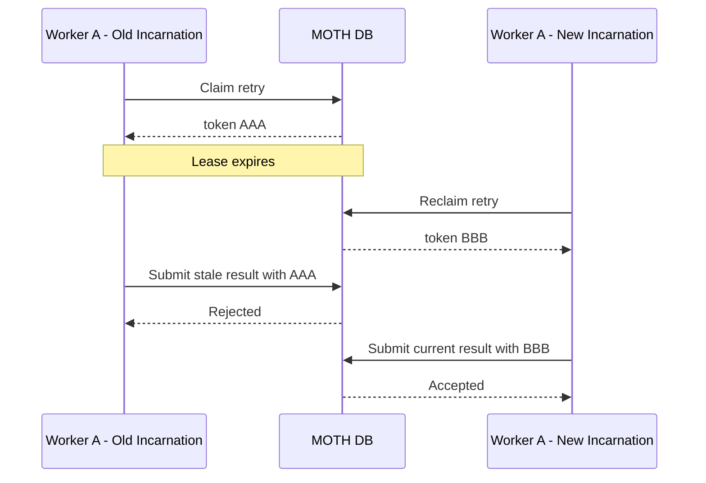
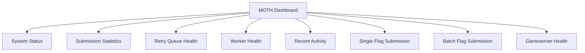
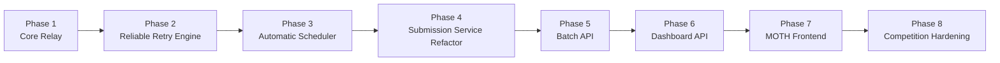
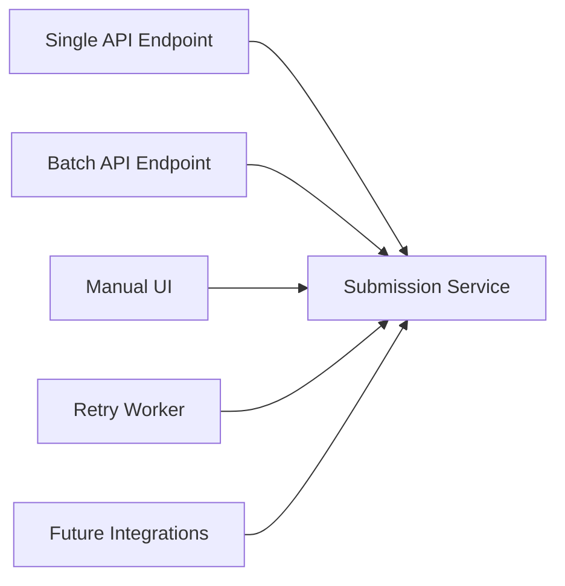
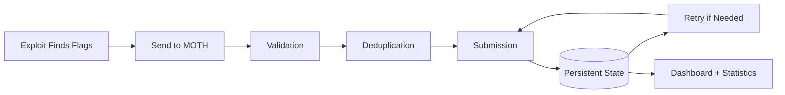

# MOTH

> Multi-Operator Transmission Hub
> A flag submission relay for FAUST CTF with encrypted persistence, retry logic, concurrency protection, and a planned operator dashboard.

MOTH is designed to make flag submission intentionally boring for exploit authors and operators.

The ideal workflow is:

```text
exploit finds flag
→ send flag to MOTH
→ go back to exploiting
```

MOTH handles validation, deduplication, gameserver submission, persistence, retry scheduling, concurrency protection, and eventually operator visibility.

Mof carries the flags.

MORI guards the nest.

---

## Current status

MOTH is under active development.

Current backend status:

* FastAPI application structure
* bearer-token API authentication
* strict FAUST flag validation
* configurable gameserver host, port, and timeout
* FAUST TCP submission client
* submission response parsing
* encrypted flag storage
* keyed flag fingerprints
* local duplicate detection
* persistent submission metadata
* terminal and retryable submission states
* retry queue
* exponential retry backoff
* due-only retry selection
* atomic retry leases
* expired lease recovery
* unique per-claim fencing tokens
* stale worker result protection
* SQLite schema migration support
* isolated pytest database fixtures
* manual TCP, retry, concurrency, and fencing validation
* 53 automated tests currently passing

The next backend milestone is integrating the lease and fencing system directly into the retry worker.

---

# Why MOTH exists

During an attack-defense CTF, multiple exploit scripts and operators may discover flags at the same time.

Without a central relay, every exploit would need to know:

* how to validate a flag
* how to talk to the gameserver
* how to handle timeouts
* how to identify duplicates
* how to retry failed submissions
* how long to wait between retries
* how to persist unfinished work
* how to avoid two workers retrying the same flag
* how to prevent stale workers from overwriting newer state

MOTH centralizes all of that.

Exploit code should ideally only need to know:

```text
I found a flag.
Send it to MOTH.
```

MOTH handles the rest.

---

# Architecture

## Current backend architecture


```mermaid
flowchart TD
    A[Exploit Scripts] --> D[MOTH API]
    B[Manual Operators] --> D
    C[Future Dashboard] --> D

    D --> E[Bearer Authentication]
    E --> F[Flag Validation]
    F --> G[Local Deduplication]
    G --> H[Submission Logic]

    H --> I[FAUST Gameserver]
    H --> J[(Encrypted SQLite State)]

    J --> K[Retry Queue]
    K --> L[Backoff Scheduler]
    L --> M[Lease + Fencing Layer]
    M --> H
```

The core design rule is that submission behavior should live in one reusable internal service rather than being reimplemented by every API route, worker, or UI.

---

## Planned full architecture


```mermaid
flowchart TD
    A[Single Flag UI] --> E[Shared Submission Service]
    B[Batch Submission UI] --> E
    C[Exploit API] --> E
    D[Future Integrations] --> E

    E --> F[Validation]
    F --> G[Deduplication]

    G --> H[Gameserver Client]
    G --> I[(Encrypted Persistent State)]

    I --> J[Retry Scheduler]
    J --> K[Lease + Fencing]
    K --> H

    I --> L[Dashboard API]
    L --> M[MOTH Operator Dashboard]

    M --> A
    M --> B
```

One moth brain.

Many entrances.

---

# API

## Authentication

Protected endpoints use bearer authentication.

Example:

```http
Authorization: Bearer <MOTH_API_TOKEN>
```

API tokens and encryption keys must never be committed to Git.

Local configuration belongs in `.env`.

---

## Current single-flag endpoint

```http
POST /api/flags
```

Example request:

```json
{
  "flag": "FAUST_...",
  "service": "achat",
  "source": "exploit-worker-3"
}
```

The endpoint currently handles:

* authentication
* whitespace cleanup
* strict FAUST flag validation
* local duplicate detection
* gameserver submission
* terminal result persistence
* retryable result persistence
* timeout handling
* connection error handling

---

## Planned batch endpoint

A dedicated batch endpoint is planned:

```http
POST /api/flags/batch
```

Example:

```json
{
  "flags": [
    "FAUST_...",
    "FAUST_...",
    "FAUST_..."
  ],
  "service": "achat",
  "source": "exploit-worker-3"
}
```

The batch endpoint should:

* accept many flags at once
* validate each item independently
* deduplicate within the incoming batch
* reuse the same internal submission service as single submissions
* return per-item status
* return an aggregate summary
* avoid exposing unnecessary plaintext flag material
* enforce sensible batch-size limits

Planned response shape:

```json
{
  "status": "processed",
  "summary": {
    "received": 47,
    "accepted": 39,
    "duplicate": 5,
    "retryable": 2,
    "invalid": 1
  },
  "results": []
}
```

The goal is to make exploit integration intentionally boring.

Example:

```python
requests.post(
    "http://moth/api/flags/batch",
    headers={
        "Authorization": f"Bearer {TOKEN}",
    },
    json={
        "flags": discovered_flags,
        "service": "achat",
        "source": "exploit-achat",
    },
)
```

Exploit scripts should not need to implement FAUST submission protocol handling or retry logic themselves.

---

# Persistent state

MOTH stores submission state in SQLite.

Stored information currently includes:

* encrypted flag data
* keyed flag fingerprint
* submission state
* response code
* response message
* service
* source
* creation timestamp
* update timestamp
* retry count
* next retry timestamp
* last attempt timestamp
* lease owner
* lease expiry
* lease fencing token

Flags are encrypted before being written to the database.

Fingerprints are used for efficient duplicate detection without using plaintext flags as database identifiers.

Application-level database encryption protects copied database contents from directly revealing stored flag plaintext.

It does not protect against a fully compromised host or process with access to the active encryption key.

---

# Submission states

MOTH currently distinguishes between two high-level states.

## Terminal

A terminal result does not need another submission attempt.

Known terminal FAUST response codes currently include:

```text
OK
DUP
OWN
OLD
INV
```

Terminal flags count as remembered for local duplicate detection.

---

## Retryable

Retryable records represent unfinished work.

Examples include:

```text
ERR
TIMEOUT
CONNECTION_ERROR
PROTOCOL_ERROR
unknown non-terminal response codes
```

Retryable flags remain available to the retry system.

---

# Retry system

MOTH uses exponential backoff.

Current schedule:

| Retry         |                 Delay |
| ------------- | --------------------: |
| 1             |             5 seconds |
| 2             |            10 seconds |
| 3             |            20 seconds |
| 4             |            40 seconds |
| 5             |            80 seconds |
| 6             |           160 seconds |
| Later retries | capped at 300 seconds |

The retry worker only considers records whose `next_retry_at` timestamp has been reached.

Calling the worker before a retry is due produces no gameserver traffic.

---

## Retry flow


```mermaid
flowchart TD
    A[Submission Fails] --> B[Record Retryable State]
    B --> C[Increment Retry Count]
    C --> D[Calculate Backoff]
    D --> E[Set next_retry_at]
    E --> F{Retry Due?}

    F -- No --> G[Do Nothing]
    G --> F

    F -- Yes --> H[Attempt Atomic Claim]
    H --> I{Lease Acquired?}

    I -- No --> J[Another Worker Owns It]
    I -- Yes --> K[Submit to Gameserver]

    K --> L{Result}
    L -- Terminal --> M[Store Terminal State]
    L -- Retryable --> B
```

---

# Retry leases

Multiple workers must not submit the same retry simultaneously.

MOTH therefore supports atomic retry leases.

A worker claims one due retry at a time.


```mermaid
sequenceDiagram
    participant W1 as Worker A
    participant DB as MOTH DB
    participant W2 as Worker B

    W1->>DB: BEGIN IMMEDIATE
    W1->>DB: Claim one due retry
    DB-->>W1: Lease granted
    W1->>DB: COMMIT

    W2->>DB: Attempt same claim
    DB-->>W2: No due unleased record
```

Another worker cannot receive the same record while the lease remains active.

If the first worker dies, the lease eventually expires and another worker may recover the record.

---

# Fencing tokens

Worker identity alone is not sufficient for safe retry result handling.

Consider this sequence:


```mermaid
sequenceDiagram
    participant W1a as Worker A - Old Incarnation
    participant DB as MOTH DB
    participant W1b as Worker A - New Incarnation

    W1a->>DB: Claim retry
    DB-->>W1a: token AAA

    Note over W1a,DB: Lease expires

    W1b->>DB: Reclaim retry
    DB-->>W1b: token BBB

    W1a->>DB: Submit stale result with AAA
    DB-->>W1a: Rejected

    W1b->>DB: Submit current result with BBB
    DB-->>W1b: Accepted
```

Every claim receives a unique random fencing token.

Result writes require:

```text
worker identity
+
claim token
+
unexpired lease
```

This protects MOTH against delayed results from stale worker incarnations.

---

# Security model

MOTH currently provides several layers of protection.

## API authentication

Protected API routes require a bearer token.

Invalid, malformed, or missing credentials are rejected before normal flag processing.

---

## Flag validation

Only flags matching the expected FAUST format are accepted.

Malformed input is rejected before submission.

---

## Database encryption

Flags are encrypted using authenticated encryption before persistence.

A separate keyed fingerprint is used for duplicate detection.

Encryption and fingerprinting use independently derived keys.

---

## Secret handling

The following must not be committed:

```text
MOTH_DB_KEY
MOTH_API_TOKEN
competition credentials
deployment-specific secrets
```

Private Git is not a secret manager.

---

## Transport security

Bearer authentication alone does not provide encrypted transport.

Competition deployment must use an appropriately trusted transport layer, isolated network, VPN, TLS, or another suitable deployment design.

Final transport architecture is still to be decided.

---

# MORI

MORI owns security.

Current responsibilities include:

* rejecting missing authorization
* rejecting malformed authorization
* rejecting unknown API tokens
* guarding retry claims
* enforcing lease ownership
* rejecting stale fencing tokens
* preventing concurrent custody disputes
* generally having violence in her heart

---

# Mof

Mof owns transport.

Current responsibilities include:

* carrying flags
* talking TCP
* finding the gameserver
* waiting for responses
* remembering unfinished work
* retrying responsibly
* obeying backoff
* not repeatedly headbutting the lämp during outages

---

# Planned operator dashboard

MOTH will receive a proper web frontend.

The dashboard is intended to be a practical competition control surface rather than decoration layered on top of the API.

Visual direction:

* dark purple
* lavender
* Mof
* MORI
* moth motifs
* operational clarity first
* unnecessary amounts of personality second

---

## Planned dashboard layout


```mermaid
flowchart TD
    A[MOTH Dashboard] --> B[System Status]
    A --> C[Submission Statistics]
    A --> D[Retry Queue Health]
    A --> E[Worker Health]
    A --> F[Recent Activity]
    A --> G[Single Flag Submission]
    A --> H[Batch Flag Submission]
    A --> I[Gameserver Health]
```

---

# Planned dashboard statistics

The dashboard should eventually expose operational data such as:

* total flags received
* accepted flags
* local duplicates
* gameserver duplicates
* own flags
* old flags
* invalid flags
* retryable flags
* active leases
* retry queue depth
* oldest pending retry
* current retry distribution
* flags per minute
* success rate
* gameserver connectivity
* submission activity over time
* per-service submission counts
* per-source submission counts
* recent result feed
* worker health
* MORI rejection count

Plaintext flag values should not be sprayed across dashboards, logs, or telemetry.

---

# Planned manual submission UI

The dashboard will include a simple single-flag form.

Planned fields:

```text
flag
service
source
```

The goal is fast operator use during competition.

A human who discovers one flag should be able to paste it and submit it with almost no friction.

---

# Planned multi-flag submission UI

A second interface will accept many flags at once.

Example input:

```text
FAUST_...
FAUST_...
FAUST_...
FAUST_...
```

The frontend should:

* parse one flag per line
* identify malformed entries
* deduplicate pasted data before submission
* display a clear aggregate result
* display useful per-item failures
* avoid unnecessarily rendering sensitive flag material
* remain usable when pasting large batches

Example summary:

```text
47 received
39 accepted
5 duplicates
2 retrying
1 invalid
```

---

# Planned frontend state

Mof should visually react to MOTH state.

Possible states:

| System state       | Mof behavior             |
| ------------------ | ------------------------ |
| Idle               | resting near the lämp    |
| Submitting         | flying                   |
| Connection failure | bonked into the lämp     |
| Large retry queue  | distressed moth activity |
| Healthy system     | peaceful moth operations |

MORI may appear around security, access control, lease, and rejection information.

MORI should remain judgmental.

---

# Planned operator controls

The first dashboard version should primarily be read-only outside normal flag submission.

Future privileged controls may include:

* retry now
* pause retry worker
* resume retry worker
* inspect queue
* drain queue
* worker status
* gameserver connectivity test

Administrative controls should require stronger authorization than ordinary dashboard viewing.

---

# Development roadmap


```mermaid
flowchart LR
    A[Phase 1<br/>Core Relay]
    B[Phase 2<br/>Reliable Retry Engine]
    C[Phase 3<br/>Automatic Scheduler]
    D[Phase 4<br/>Submission Service Refactor]
    E[Phase 5<br/>Batch API]
    F[Phase 6<br/>Dashboard API]
    G[Phase 7<br/>MOTH Frontend]
    H[Phase 8<br/>Competition Hardening]

    A --> B --> C --> D --> E --> F --> G --> H
```

---

## Phase 1: Core relay

Status: mostly complete.

Includes:

* FastAPI
* authentication
* flag validation
* gameserver communication
* encrypted persistence
* duplicate detection
* response state handling

---

## Phase 2: Reliable retry engine

Status: active.

Completed:

* retry queue
* exponential backoff
* due-time filtering
* atomic claims
* lease recovery
* fencing tokens
* stale worker rejection

Next:

* integrate leases into the real retry worker
* process one atomic claim at a time
* test concurrent workers end-to-end
* decide worker identity lifecycle
* graceful interruption handling

---

## Phase 3: Automatic retry scheduling

Planned.

Includes:

* application lifecycle integration
* controlled periodic worker execution
* graceful startup
* graceful shutdown
* no uncontrolled infinite retry loops
* observable worker health

---

## Phase 4: Submission service refactor

Planned.

Move submission orchestration into one reusable internal service.

Consumers:


```mermaid
flowchart LR
    A[Single API Endpoint] --> E[Submission Service]
    B[Batch API Endpoint] --> E
    C[Manual UI] --> E
    D[Retry Worker] --> E
    F[Future Integrations] --> E
```

This avoids business logic divergence between API routes, workers, and UI code.

---

## Phase 5: Batch submission API

Planned.

Includes:

* `/api/flags/batch`
* per-item validation
* in-batch deduplication
* aggregate result summaries
* bounded batch sizes
* sensible concurrency limits

---

## Phase 6: Dashboard API

Planned.

Expose safe aggregated operational information such as:

* submission counts
* result counts
* retry queue state
* active leases
* worker state
* gameserver health
* per-service statistics
* timeline data

Dashboard endpoints must avoid leaking plaintext flags or secrets.

---

## Phase 7: MOTH frontend

Planned.

Includes:

* Mof
* MORI
* dark purple and lavender visual system
* system status
* statistics dashboard
* recent activity
* single flag submission
* multi-flag submission
* retry health
* worker health

---

## Phase 8: Competition hardening

Required before FAUST deployment.

Includes:

* reverify official FAUST submission protocol
* final gameserver configuration
* deployment network design
* API transport protection
* secret distribution strategy
* load testing
* multi-worker testing
* crash recovery testing
* malformed response testing
* slow gameserver testing
* gameserver outage rehearsal
* database backup strategy
* logging review
* telemetry review
* ensure flags never leak through logs
* full end-to-end competition rehearsal

---

# Testing philosophy

MOTH uses both automated and manual testing.

Current automated suite:

```text
53 passing tests
```

Manual testing has included:

* real local TCP submission
* gameserver refusal
* communication timeout
* fake server delay
* retryable to terminal transitions
* encrypted persistence inspection
* retry queue operation
* exponential backoff
* due-only retry behavior
* simultaneous retry claims
* lease expiry recovery
* stale worker result rejection
* same-worker-ID reincarnation fencing

Manual testing is intentionally retained for stateful and concurrency-sensitive features even when automated regression tests exist.

---

# Local development

Create and activate a virtual environment.

Install dependencies:

```powershell
pip install -r requirements-dev.txt
```

Run tests:

```powershell
pytest -v
```

Run MOTH:

```powershell
uvicorn app.main:app --reload
```

---

# Configuration

Typical local `.env` configuration includes:

```text
MOTH_DB_KEY=
MOTH_API_TOKEN=
MOTH_SUBMISSION_HOST=
MOTH_SUBMISSION_PORT=
MOTH_SUBMISSION_TIMEOUT=
```

Never commit the real values.

---

# Repository workflow

This repository is the active private development version of MOTH.

Development commits are signed.

The public GitHub repository should remain a sanitized snapshot and should not automatically receive active competition development or sensitive implementation details.

Normal private development pushes should target the TTZ remote.

---

# Project philosophy

MOTH should be:

* simple to use
* difficult to misuse
* boring to integrate
* safe under failure
* observable under pressure

The backend should be reliable enough that exploit authors do not need to think about submission infrastructure.

The frontend should be clear enough that an operator can understand what is happening at a glance.

The implementation can still contain an unreasonable amount of moth.

---

# Final goal


```mermaid
flowchart LR
    A[Exploit Finds Flags] --> B[Send to MOTH]
    B --> C[Validation]
    C --> D[Deduplication]
    D --> E[Submission]
    E --> F[(Persistent State)]
    F --> G[Retry if Needed]
    G --> E
    F --> H[Dashboard + Statistics]
```

During competition, the exploit author should only care about the first two boxes.

MOTH handles the rest.

Mof carries the flags.

MORI guards the nest.

MORI says hi.
