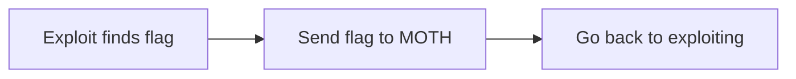
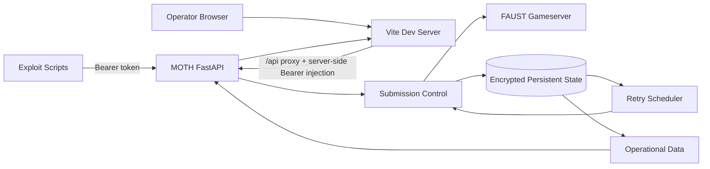
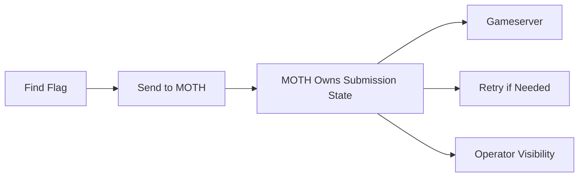

# MOTH

```text
ཐི༏ཋྀ    ཐིཋྀ    ʚïɞ    ᖭི༏ᖫྀ

࿔‧ ֶָ֢˚˖𐦍˖˚ֶָ֢ ‧࿔

⁺‧₊˚ ཐི⋆♱⋆ཋྀ ˚₊‧⁺
```

> **Multi-Operator Transmission Hub**
> A flag submission relay and operator control surface for FAUST CTF.

MOTH exists so exploit authors do not have to carry submission infrastructure inside every exploit.

The intended workflow is deliberately boring:


```mermaid
flowchart LR
    A[Exploit finds flag] --> B[Send flag to MOTH]
    B --> C[Go back to exploiting]
```

Mof carries the flags.

MORI guards the nest.

```text
Mof:
ཐི༏ཋྀ    ཐིཋྀ    ʚïɞ    ᖭི༏ᖫྀ

MORI:
₍^. .^₎⟆
```

---

## What MOTH does

MOTH centralizes the parts of flag submission that should not be reimplemented by every operator or exploit:

* authenticated flag intake
* strict FAUST flag validation
* single and batch submission
* gameserver protocol handling
* encrypted persistent state
* duplicate detection
* automatic retry scheduling
* claim and lease fencing
* concurrency protection
* bounded overload behavior
* safe operational telemetry
* dashboard-facing status data
* live operator visibility
* manual operator submission

Exploit code should only need to know where MOTH is and how to authenticate to it.

---

## Current project state

The backend and operator control surface are implemented.

The current private development state includes:

* FastAPI submission API
* encrypted SQLite persistence
* duplicate and same-flag race protection
* bounded initial-submission capacity
* retry scheduling with persistent leases and fencing
* batch submission
* operational telemetry
* dashboard health, statistics, recent activity, and connectivity endpoints
* React + TypeScript + Vite operator frontend
* live self-scheduling dashboard polling
* manual flag offering from the control surface
* backend automated tests
* frontend Vitest + React Testing Library coverage
* local race, stress, outage, and recovery tooling
* benchmark and limitation documentation

The project has been exercised against local race, concurrency, authentication-flood, batch, persistence, retry, gameserver-failure, dashboard-load, and recovery scenarios.

Current measurements describe the local development environment only. They are evidence for design decisions, not production-capacity guarantees.

---

## System overview

The local development shape is:


```mermaid
flowchart LR
    EXPLOIT[Exploit Scripts] -->|Bearer token| API[MOTH FastAPI]

    OPERATOR[Operator Browser] --> VITE[Vite Dev Server]
    VITE -->|/api proxy + server-side Bearer injection| API

    API --> CONTROL[Submission Control]
    CONTROL --> GAME[FAUST Gameserver]
    CONTROL --> STATE[(Encrypted Persistent State)]

    STATE --> RETRY[Retry Scheduler]
    RETRY --> CONTROL

    STATE --> TELEMETRY[Operational Data]
    TELEMETRY --> API
    API --> VITE
```

The Vite authentication proxy is a **local development boundary**. It keeps `MOTH_API_TOKEN` on the server side instead of exposing it as a `VITE_*` browser variable.

It is not the final competition transport or secret-distribution design.

The detailed request lifecycle, database model, concurrency controls, retry fencing, telemetry model, frontend boundary, and hardening rationale live in [`docs/ARCHITECTURE.md`](docs/ARCHITECTURE.md).

---

## API surfaces

MOTH exposes four operational groups:

* single and batch flag submission
* basic application health
* dashboard statistics, recent activity, and operational health
* explicit gameserver connectivity probing

The exact routes, payloads, response handling, PowerShell commands, frontend startup, exploit examples, and troubleshooting steps live in [`docs/USAGE.md`](docs/USAGE.md).

---

## Operator frontend

The control surface is implemented in React + TypeScript with Vite.

It provides:

* live MOTH health
* scheduler and retry-queue state
* submission statistics
* gameserver reachability
* recent operational activity
* manual flag submission

Polling is self-scheduling rather than a blind overlapping interval. Health, statistics, and recent activity refresh on the normal cycle, while the more expensive live gameserver connectivity probe is sampled less frequently.

Frontend architecture and visual behavior live in [`docs/FRONTEND.md`](docs/FRONTEND.md).

---

## Security posture

MOTH is designed to reduce accidental flag loss, duplicate submission, stale-worker corruption, and uncontrolled load.

Operational event data is intentionally separated from sensitive flag material. Stored flags are protected using application-level encryption and keyed fingerprints.

The normal dashboard does not need plaintext flags.

MOTH does **not** replace:

* host security
* transport protection
* secret management
* deployment isolation
* reverse-proxy limits
* competition network policy

Bearer authentication is not transport encryption.

Known deployment and implementation boundaries are tracked in [`docs/CURRENT_LIMITATIONS.md`](docs/CURRENT_LIMITATIONS.md).

---

## Repository orientation

The repository is organized around these main areas:

| Path | Purpose |
| --- | --- |
| `app/api/` | HTTP routes and response shaping |
| `app/core/` | auth, submission, retry, scheduling, networking, capacity |
| `app/db/` | persistent state, claims, events, dashboard queries |
| `frontend/` | React + TypeScript operator control surface |
| `tests/` | backend regression tests |
| `tools/` | fake gameserver, race tools, stress tools |
| `docs/` | architecture, usage, frontend, benchmarks, limitations |

The frontend contains its own automated tests and build tooling.

---

## Documentation map

### `README.md`

Use this file for:

* project purpose
* current state
* high-level system shape
* repository orientation

### `docs/ARCHITECTURE.md`

Use the architecture document for:

* technical invariants
* component boundaries
* request lifecycle
* submission claims
* retry leases and fencing
* atomic finalization
* persistence design
* telemetry design
* frontend/backend boundaries
* SQLite concurrency model
* security boundaries

### `docs/USAGE.md`

Use the team guide for:

* local startup
* configuration
* API calls
* exploit integration
* frontend startup
* dashboard access
* automated tests
* stress tools
* competition startup
* troubleshooting
* Git workflow

### `docs/FRONTEND.md`

Use the frontend document for:

* control-surface structure
* Vite development proxy behavior
* polling behavior
* component responsibilities
* visual design rules

### `docs/BENCHMARKS.md`

Use the benchmark document for:

* measured local load tests
* race results
* outage and recovery observations
* dashboard behavior under pressure
* exact test conditions and limitations

### `docs/CURRENT_LIMITATIONS.md`

Use the limitations document for:

* known deployment assumptions
* current scaling boundaries
* remaining operational decisions
* intentionally unfinished production concerns

The goal is that each subject has one authoritative home instead of several slightly different explanations.

---

## Development verification

Backend:

```powershell
pytest
```

Frontend:

```powershell
cd .\frontend
npm test
npm run build
cd ..
```

For concurrency and failure-sensitive behavior, automated tests are supplemented by the local race, stress, and fake-gameserver tools documented in [`docs/USAGE.md`](docs/USAGE.md).

---

## Development principles

MOTH should be:

* simple to integrate
* difficult to misuse
* predictable under failure
* bounded under overload
* safe under concurrency
* observable without leaking flags
* understandable during competition

A useful rule for the backend is:

> Every expensive or state-changing action should have one clear owner.

A useful rule for the operator frontend is:

> Show operational truth without becoming another secret store.

---

## Control-surface direction

The operator frontend stays operational first and decorative second.

Visual direction:

* dark purple
* lavender
* Mof
* MORI
* cybersigilism
* terminal workstation
* clear system state
* unnecessary amounts of moth

No secrets belong in the browser bundle.

---

## Final goal


```mermaid
flowchart LR
    A[Find Flag] --> B[Send to MOTH]
    B --> C[MOTH Owns Submission State]
    C --> D[Gameserver]
    C --> E[Retry if Needed]
    C --> F[Operator Visibility]
```

During competition, exploit authors should mostly care about the first two steps.

MOTH handles the rest.

```text
ཐི༏ཋྀ    ཐིཋྀ    ʚïɞ    ᖭི༏ᖫྀ

࿔‧ ֶָ֢˚˖𐦍˖˚ֶָ֢ ‧࿔

⁺‧₊˚ ཐི⋆♱⋆ཋྀ ˚₊‧⁺
```

Mof carries the flags.

```text
₍^. .^₎⟆
```

MORI guards the nest.

MORI says hi.