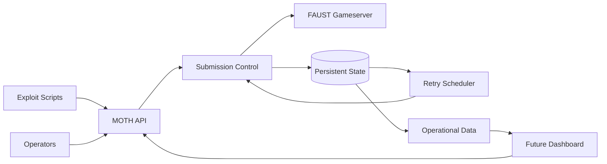
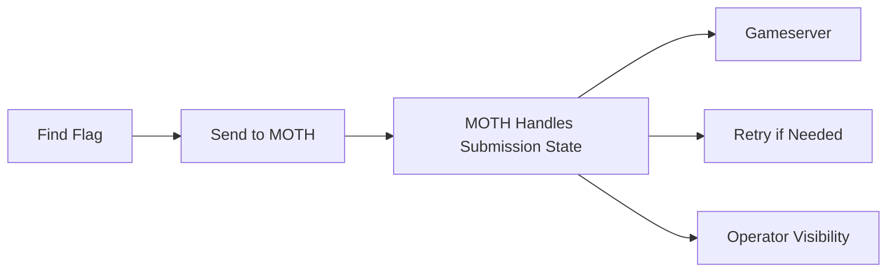

# MOTH

```text
ཐི༏ཋྀ    ཐིཋྀ    ʚïɞ    ᖭི༏ᖫྀ

࿔‧ ֶָ֢˚˖𐦍˖˚ֶָ֢ ‧࿔

⁺‧₊˚ ཐི⋆♱⋆ཋྀ ˚₊‧⁺
```

> **Multi-Operator Transmission Hub**
> A flag submission relay for FAUST CTF.

MOTH exists so exploit authors do not have to carry submission infrastructure inside every exploit.

The intended workflow is deliberately boring:

```text
exploit finds flag
→ send flag to MOTH
→ go back to exploiting
```

Mof carries the flags.

MORI guards the nest.

```text
Mof:
ཐི༏ཋྀ    ཐིཋྀ    ʚïɞ    ᖭི༏ᖫྀ

MORI:
/•᷅‎‎•᷄\੭
```

---

## What MOTH does

MOTH centralizes the parts of flag submission that should not be reimplemented by every operator or exploit:

* authenticated flag intake
* strict FAUST flag validation
* gameserver protocol handling
* encrypted persistent state
* duplicate detection
* automatic retry scheduling
* concurrency protection
* bounded overload behavior
* safe operational telemetry
* dashboard-facing status data

Exploit code should only need to know where MOTH is and how to authenticate to it.

---

## Current project state

The core backend is implemented and under competition hardening.

Current work focuses on:

* stress testing
* failure-mode rehearsal
* deployment design
* operational runbooks
* frontend development

The backend has been exercised against local race, concurrency, authentication-flood, batch, persistence, retry, and gameserver-failure scenarios.

---

## System overview


```mermaid
flowchart LR
    A[Exploit Scripts] --> B[MOTH API]
    C[Operators] --> B
    D[Future Dashboard] --> B

    B --> E[Submission Control]
    E --> F[FAUST Gameserver]
    E --> G[(Persistent State)]

    G --> H[Retry Scheduler]
    H --> E

    G --> I[Operational Data]
    I --> D
```

This diagram is intentionally high level.

The detailed request lifecycle, database model, concurrency controls, retry fencing, telemetry model, and hardening rationale live in [`docs/ARCHITECTURE.md`](docs/ARCHITECTURE.md).

---

## API surfaces

MOTH currently exposes three groups of HTTP functionality:

* single and batch flag submission
* application and operational health
* dashboard statistics and recent activity

The exact routes, payloads, response handling, PowerShell commands, exploit examples, and troubleshooting steps belong in [`docs/USAGE.md`](docs/USAGE.md).

---

## Security posture

MOTH is designed to reduce accidental flag loss, duplicate submission, stale-worker corruption, and uncontrolled load.

It also avoids treating telemetry as another flag store.

Operational event data is intentionally separated from sensitive flag material, and stored flags are protected using application-level encryption and keyed fingerprints.

MOTH does **not** replace host security, transport protection, secret management, or deployment isolation.

Those deployment boundaries are documented in [`docs/ARCHITECTURE.md`](docs/ARCHITECTURE.md) and the competition runbook in [`docs/USAGE.md`](docs/USAGE.md).

---

## Repository layout

```text
MOTH/
├── app/
│   ├── api/
│   ├── core/
│   └── db/
├── docs/
│   ├── ARCHITECTURE.md
│   └── USAGE.md
├── tests/
├── tools/
└── README.md
```

The source tree is organized around three backend concerns:

```text
api   → HTTP surfaces
core  → submission, retry, scheduling, auth, networking
db    → persistent state, claims, events, dashboard queries
```

Local stress and fake-gameserver utilities live under `tools/`.

---

## Documentation map

### `README.md`

Use this file for:

* project purpose
* current status
* high-level system shape
* repository orientation

### `docs/ARCHITECTURE.md`

Use the architecture document for:

* technical invariants
* request lifecycle
* submission claims
* retry leases and fencing
* atomic finalization
* persistence design
* telemetry design
* SQLite concurrency model
* hardening evidence
* security boundaries

### `docs/USAGE.md`

Use the team guide for:

* local startup
* configuration
* API calls
* exploit integration
* dashboard access
* stress tools
* competition startup
* troubleshooting
* Git workflow

The goal is that each subject has one authoritative home instead of three slightly different explanations.

---

## Development principles

MOTH should be:

* simple to integrate
* difficult to misuse
* predictable under failure
* bounded under overload
* safe under concurrency
* observable without leaking flags
* understandable during competition

A useful rule for the backend is:

> Every expensive or state-changing action should have one clear owner.

---

## Frontend direction

The future operator frontend should remain operational first and decorative second.

Visual direction:

* dark purple
* lavender
* Mof
* MORI
* cybersigilism
* clear system state
* unnecessary amounts of moth

---

## Final goal


```mermaid
flowchart LR
    A[Find Flag] --> B[Send to MOTH]
    B --> C[MOTH Handles Submission State]
    C --> D[Gameserver]
    C --> E[Retry if Needed]
    C --> F[Operator Visibility]
```

During competition, exploit authors should only care about the first two boxes.

MOTH handles the rest.

```text
ཐི༏ཋྀ    ཐིཋྀ    ʚïɞ    ᖭི༏ᖫྀ

࿔‧ ֶָ֢˚˖𐦍˖˚ֶָ֢ ‧࿔

⁺‧₊˚ ཐི⋆♱⋆ཋྀ ˚₊‧⁺
```

Mof carries the flags.

```text
/•᷅‎‎•᷄\੭
```

MORI guards the nest.

MORI says hi.
