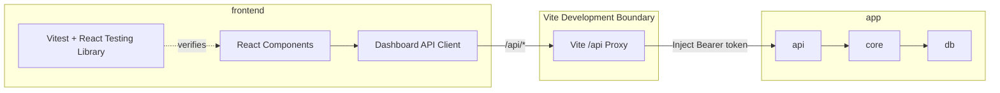
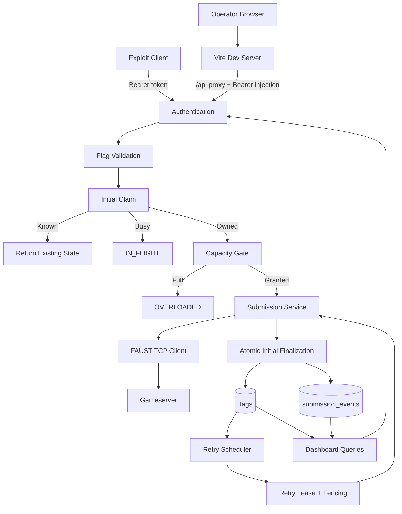
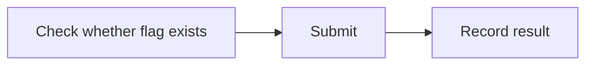
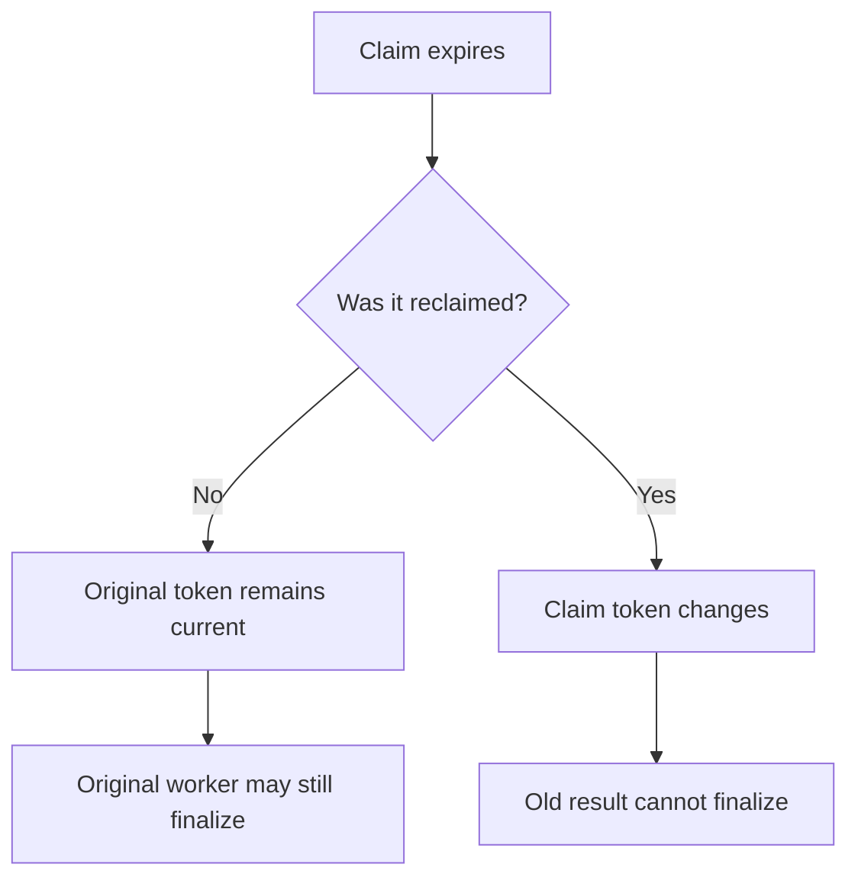
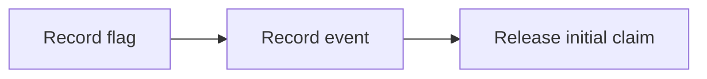
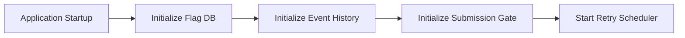
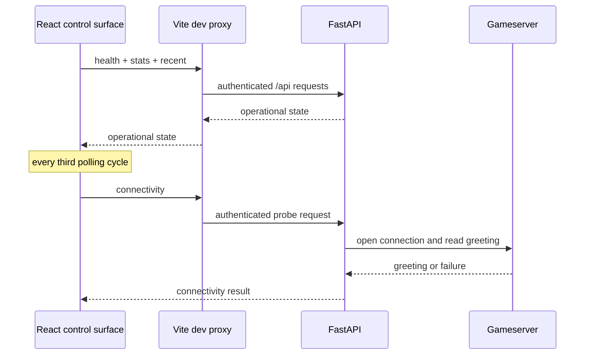
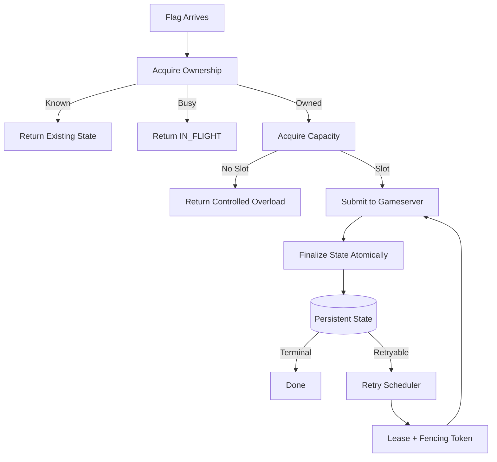

# MOTH Architecture

> Technical architecture and invariants for the Multi-Operator Transmission Hub.

```text
ཐི༏ཋྀ
Mof moves the flags.

₍^. .^₎⟆
MORI decides who owns the state.
```

---

## 1. Scope of this document

This document describes how MOTH works internally.

It is the authoritative home for:

* component boundaries
* request ownership
* persistence rules
* concurrency controls
* retry coordination
* telemetry design
* frontend/backend boundaries
* development authentication boundaries
* SQLite transaction choices
* security boundaries
* hardening rationale

It intentionally does **not** contain operator commands, PowerShell walkthroughs, Git procedures, or competition checklists. Those belong in `docs/USAGE.md`.

Frontend-specific composition and visual rules live in `docs/FRONTEND.md`. Measured local load results live in `docs/BENCHMARKS.md`. Known deployment and implementation boundaries live in `docs/CURRENT_LIMITATIONS.md`.

---

## 2. Core invariants

MOTH is built around a small set of invariants.

### One owner per new flag

At most one initial submission claim may exist for one keyed flag fingerprint.

### One owner per retry

A retryable record may have at most one active retry lease.

### One current result writer

Retry results are accepted only from the current lease owner with the current fencing token.

Initial results are accepted only while their claim owner and claim token still match.

### One bounded submission budget

Expensive initial submission work is subject to process-local capacity control.

### One atomic state transition

Successful initial submission finalization persists the flag state and releases its claim in one transaction.

### Telemetry is non-critical

Failure to record operational telemetry must not destroy valid flag state.

---

## 3. Component boundaries

The system is split into a browser-facing control surface, a development proxy boundary, and backend layers with deliberately narrow responsibilities.



Backend responsibilities are intentionally split:

| Layer | Responsibility |
| --- | --- |
| `api` | HTTP validation, response shaping, route-level orchestration |
| `core` | auth, network submission, result classification, scheduling, capacity |
| `db` | persistent state, claims, leases, events, dashboard queries |

Frontend responsibilities are intentionally split as well:

| Area | Responsibility |
| --- | --- |
| React components | operator presentation and interaction |
| `src/api/` | typed HTTP access to dashboard and submission routes |
| Vite development proxy | local `/api` forwarding and server-side bearer injection |
| frontend tests | deterministic UI, polling, submission, and rendering regressions |

The API layer should not reimplement gameserver protocol behavior or retry state transitions.

The browser must not receive `MOTH_API_TOKEN` through a `VITE_*` environment variable. The current Vite proxy is a development convenience, not the final competition secret-distribution model.

---

## 4. High-level data flow



---

## 5. Flag identity and cryptographic storage

MOTH separates three concerns:

* plaintext flag value used only while processing
* encrypted flag payload used for persistence
* keyed fingerprint used for identity and lookup

The plaintext flag is not used as a database identifier.

The fingerprint supports:

* duplicate lookup
* initial-submission claims
* persistent-state lookup

Encryption and fingerprinting use independently derived key material.

This protects copied database contents from trivially revealing stored flags.

It does not protect against a host or process that already has access to the active key material.

---

## 6. Persistent state model

### `flags`

The persistent flag table carries submission state, encrypted flag material, metadata, retry state, and retry lease state.

Conceptually it groups fields by responsibility:

| Group | Fields |
| --- | --- |
| identity | `flag_ciphertext`, `flag_nonce`, `flag_fingerprint` |
| submission state | `submission_state`, `response_code`, `response_message`, `service`, `source` |
| time | `created_at`, `updated_at`, `last_attempt_at` |
| retry | `retry_count`, `next_retry_at`, `lease_owner`, `lease_until`, `lease_token` |

### `initial_submission_claims`

Initial submissions use a separate short-lived ownership table:

```text
flag_fingerprint
owner
lease_token
lease_until
created_at
```

The fingerprint is the claim key.

### `submission_events`

Operational history is stored separately from flag state:

```text
event_type
code
state
service
source
worker_id
event_count
created_at
```

The event table intentionally does not need plaintext flag material.

---

## 7. Initial submission gate

### The race it prevents

A naive flow is unsafe:



The problem is the gap between `CHECK` and `RECORD`.

Concurrent callers can all observe the same flag as absent before any one of them records it.

MOTH instead claims the keyed fingerprint before contacting the gameserver.

### Claim outcomes

The gate returns one of three ownership states:

| State | Meaning |
| --- | --- |
| `existing` | persistent state already exists |
| `busy` | another initial caller owns the fingerprint |
| `claimed` | this caller owns a unique claim token |

An `existing` retryable record remains under retry-scheduler control rather than being immediately resubmitted through the API.

A `busy` initial claim produces `IN_FLIGHT` behavior.

---

## 8. Initial claim recovery and fencing

Initial claims have an expiry so abandoned claims can be recovered.

Recovery changes the claim token.

Finalization requires the exact current combination of:

```text
flag fingerprint
owner
claim token
```

The important semantic is that the timestamp is used to decide whether another caller may reclaim the claim, while the token decides whether a result is still current.

Therefore:



This preserves useful slow responses without allowing stale results to overwrite newer ownership.

---

## 9. Submission capacity and backpressure

Unique valid flags represent real work and cannot be deduplicated away.

MOTH therefore limits active initial submission pipelines per application process.

The current limit is:

```text
64 active initial submissions per process
```

The limit is intentionally below the locally observed instability point.

If capacity is exhausted, the caller receives controlled overload behavior and the initial claim is released.

This design prefers explicit backpressure over letting connection churn, SQLite contention, and event-loop pressure decide which requests fail randomly.

The capacity limiter is process-local, which matters when choosing application worker count.

---

## 10. Shared submission service

Network submission behavior is centralized in one internal service.

The service owns:

* gameserver configuration lookup
* TCP submission invocation
* terminal versus retryable classification
* timeout classification
* connection-failure classification
* protocol-error classification

Both initial submissions and retry workers use this same result model.

This prevents route-specific and worker-specific interpretations from drifting apart.

---

## 11. Gameserver protocol boundary

The TCP submitter owns the raw FAUST interaction:

1. open the TCP connection
2. read the greeting through the blank-line terminator
3. send one flag and newline
4. read one response line
5. parse the result
6. close the connection

The higher layers operate on classified submission results rather than TCP framing details.

---

## 12. Submission state model

MOTH stores two application-level classes of submission state.

### Terminal

Known terminal FAUST response codes include:

```text
OK
DUP
OWN
OLD
INV
```

Terminal records are complete and do not need another submission attempt.

### Retryable

Retryable conditions include gameserver retry responses and local communication failures such as:

```text
ERR
TIMEOUT
CONNECTION_ERROR
PROTOCOL_ERROR
unknown non-terminal response codes
```

Retryable records remain under scheduler control.

---

## 13. Atomic initial finalization

The initial design finalized one submission through multiple independent writes:



That increased write-lock churn and created more intermediate states.

The current design uses one transaction after the network result is known.

```text
BEGIN IMMEDIATE

verify current claim token
verify no persistent flag already exists

insert encrypted flag state

SAVEPOINT event
    attempt submission event insert
    if telemetry fails:
        roll back event only
RELEASE event

delete exact initial claim

COMMIT
```

### Guarantees

Flag persistence and claim release are atomic.

Telemetry is best effort.

A broken event write must not erase an otherwise valid submission result.

---

## 14. Retry scheduling

Retryable submissions receive a persistent retry counter and next-attempt timestamp.

The current backoff schedule is:

| Retry | Delay |
| --- | ---: |
| 1 | 5 seconds |
| 2 | 10 seconds |
| 3 | 20 seconds |
| 4 | 40 seconds |
| 5 | 80 seconds |
| 6 | 160 seconds |
| Later retries | capped at 300 seconds |

Only due records may be claimed by the retry worker.

The scheduler repeatedly asks for due work rather than repeatedly resubmitting every retryable record.

---

## 15. Retry leases

Retry workers coordinate through the persistent `flags` table.

A claim operation uses an immediate transaction to select one due record and assign:

```text
lease_owner
lease_until
lease_token
```

Other workers cannot claim that record while the lease remains active.

If the worker disappears, the lease can eventually be recovered.

---

## 16. Retry fencing

Lease ownership alone cannot protect against delayed results from an old worker incarnation.

Every retry claim receives a unique token.

A retry result is accepted only when the record still matches the expected owner and token and the retry lease remains valid.

This prevents a stale worker from overwriting newer retry state.

---

## 17. Scheduler lifecycle

The scheduler belongs to the FastAPI application lifecycle.

Startup initializes persistent subsystems before beginning retry work.



Shutdown signals the scheduler to stop and flushes pending batched telemetry.

Scheduler iteration failures are isolated so one failed pass does not permanently kill retry processing.

---

## 18. Batch execution model

Batch processing has two distinct stages.

### Parse and classify

The endpoint first:

* validates every input independently
* identifies invalid entries
* identifies repeated flags inside the same request
* builds a unique work set

### Bounded execution

Unique work is processed with a small per-batch concurrency limit.

The current limit is eight concurrent unique items per batch.

Results are reconstructed into original input order after processing.

The per-batch limit does not replace the global submission-capacity limiter.

---

## 19. Operational event model

Operational telemetry is intentionally separate from flag state.

This gives the dashboard useful history without forcing it to read sensitive flag material.

Events may describe:

* initial submissions
* retries
* stale retry results
* local duplicates
* invalid input
* authentication rejection
* overload conditions

Telemetry is not the source of truth for whether a flag was persisted.

---

## 20. Batched telemetry

Low-value repeated events may be aggregated in memory before persistence.

A persisted event row can represent multiple logical events through `event_count`.

This reduces write amplification during repeated authentication rejection and other high-volume rejection paths.

Pending in-memory counts are included in dashboard metrics and flushed during clean shutdown.

In a multi-process deployment, pending batches are process-local until flushed.

---

## 21. Dashboard data boundary

Dashboard endpoints derive information from persistent flag state, event history, and scheduler state.

They do not need plaintext flags for normal operational visibility.

The dashboard backend separates two kinds of observation:

* internal application health and queue state
* explicit live gameserver connectivity probing

The connectivity probe is intentionally separate so routine dashboard polling does not repeatedly open gameserver connections.

The React control surface consumes the same authenticated API rather than reading the database directly.

Its development polling model is intentionally staggered:

* health, statistics, and recent activity use the normal refresh cycle
* gameserver connectivity is sampled less frequently
* a new polling cycle is scheduled only after the previous cycle settles
* manual submission triggers an immediate refresh of the relevant dashboard state

The current development cadence is approximately two seconds for health, statistics, and recent activity, with connectivity sampled every third cycle.



---

## 22. SQLite concurrency model

SQLite permits one writer at a time.

MOTH therefore optimizes for:

* short write transactions
* fewer transactions per successful submission
* bounded concurrency
* atomic ownership transitions
* batched low-value telemetry

The design does not try to make SQLite behave like a distributed multi-writer database.

It uses SQLite's transaction semantics deliberately and keeps contention bounded.

---

## 23. Multi-process implications

Some controls are shared through SQLite and some are process-local.

Shared through SQLite:

* initial flag ownership
* persistent flag state
* retry leases
* retry fencing

Process-local:

* active-submission capacity counter
* pending telemetry batches

Application worker count therefore changes aggregate submission capacity and must be part of deployment planning.

---

## 24. Failure model

MOTH distinguishes failures by ownership and persistence implications.

| Failure class | Persistent effect |
| --- | --- |
| malformed client input | no gameserver attempt |
| local overload | claim released, no submitted state |
| same flag already in flight | no duplicate gameserver attempt |
| gameserver connection failure | retryable state |
| gameserver timeout | retryable state |
| retryable gameserver response | retryable state |
| stale initial result | rejected by claim token |
| stale retry result | rejected by retry fencing |
| telemetry write failure | flag state remains authoritative |

Operational response handling belongs in `docs/USAGE.md`.

---

## 25. Security boundaries

MOTH protects against application-level mistakes such as:

* duplicate concurrent submission
* duplicate retry ownership
* stale worker result writes
* uncontrolled initial-submission concurrency
* telemetry write amplification
* accidental plaintext flag exposure through normal dashboard events

MOTH does not claim to protect against:

* full host compromise
* theft of active secrets
* malicious modification of the running process
* hostile administrators
* compromised deployment infrastructure

Bearer authentication is not transport encryption.

Network placement and transport protection remain deployment responsibilities.

---

## 26. Hardening evidence

Local stress measurements are used to validate design choices rather than to advertise production capacity.

The canonical record of current end-to-end measurements is `docs/BENCHMARKS.md`. The samples below are retained as design-history evidence for specific hardening changes.

### Same-flag race

Before initial ownership control:

```text
100 concurrent requests
100 gameserver submissions
```

After the gate:

```text
100 concurrent requests
1 submitted
99 IN_FLIGHT
1 gameserver submission
```

### Authentication telemetry

Before batching:

```text
2000 rejected requests
2000 event rows
288 KiB database growth
```

After batching:

```text
2000 rejected requests
20 event rows
4 KiB database growth
```

### Unique-submission overload

Without controlled backpressure:

```text
500 requests at concurrency 100
495 HTTP 200
5 client ReadError
```

With capacity control:

```text
500 requests at concurrency 100
320 HTTP 200
180 controlled HTTP 503
0 client transport errors
```

### Batch finalization

Local 500-flag batch latency improved across the hardening work:

```text
sequential path           11.61 s
bounded batch execution    8.25 s
atomic finalization        4.82 s
```

A four-request batch run offering 1000 total flags completed with all 1000 flags and all 1000 submission events persisted.

These measurements describe one local development environment only.

---

## 27. Testing philosophy

Automated tests cover deterministic behavior and regression boundaries.

Backend tests use `pytest`.

Frontend tests use Vitest with React Testing Library and cover operator-visible behavior such as:

* initial dashboard state
* manual flag submission
* local rejection of an empty offering
* state refresh after submission
* continued polling
* gameserver failure rendering without losing unrelated state

Manual local tests remain important for:

* real TCP behavior
* browser behavior against the live backend
* race conditions
* concurrency limits
* slow gameserver behavior
* unavailable gameserver behavior
* recovery after gameserver outage
* database growth
* outbound traffic amplification

Concurrency-sensitive behavior is not considered validated solely because automated tests are green.

The concrete commands live in `docs/USAGE.md`.

---

## 28. Deployment implications

Final deployment design must explicitly choose:

* network placement
* transport protection
* application process count
* reverse-proxy behavior
* request-size limits
* connection limits
* secret distribution
* restart policy
* logging destination
* backup policy

These are deployment decisions rather than hidden application assumptions.

The Vite development server and its bearer-injecting proxy are not, by themselves, the competition deployment design. Final deployment must explicitly decide how the operator frontend is served, how browser-to-MOTH traffic is protected, and where authentication credentials are allowed to exist.

---

## 29. Architecture mental model



The repeated pattern is ownership before expensive work and fencing before state mutation.

```text
ཐི༏ཋྀ

₍^. .^₎⟆
```
