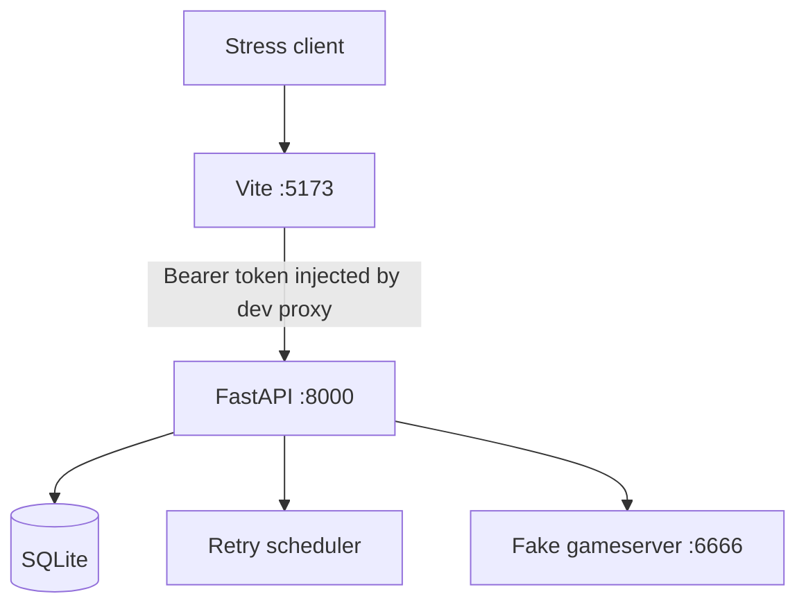
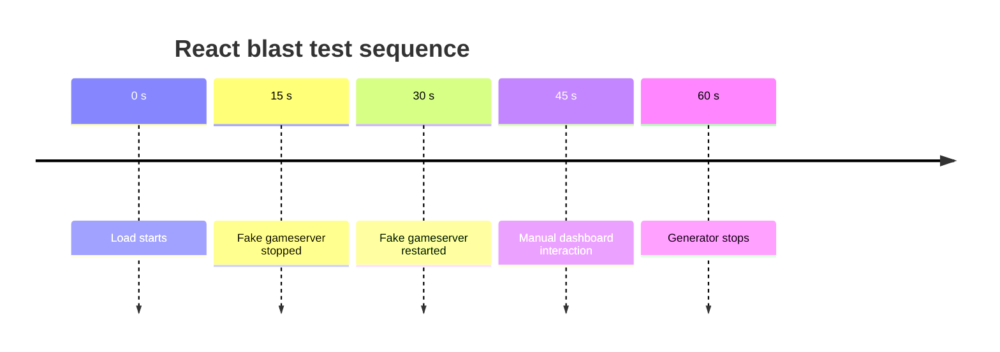

# MOTH Benchmarks

This document records observed MOTH stress, race, outage, recovery, and frontend-chaos test results.

These are development-environment measurements, not universal performance guarantees.

The primary purpose of the tests was correctness under pressure:

- no lost flags
- no duplicate gameserver submissions for one locally claimed flag
- no stuck retry leases
- no stale retry results
- consistent attempt accounting
- clean recovery after gameserver failure
- dashboard availability under mixed load
- live React polling during backend chaos

## Test Path

Unless otherwise noted, requests were sent through the frontend development path:



This means the benchmark path exercised the Vite proxy as well as the backend.

## Baseline Reset

Before the main benchmark sequence, the local SQLite database was removed and recreated.

Initial health after restart:

```json
{
  "status": "healthy",
  "scheduler": {
    "state": "running",
    "running": true
  },
  "retry_queue": {
    "state": "clear",
    "retryable": 0,
    "due": 0,
    "active_leases": 0,
    "oldest_retry_at": null
  }
}
```

## Test 1: 250 Submissions, 32 Workers

Configuration:

```text
requests  250
workers   32
```

Result:

```text
250 submitted OK
```

Observed:

- 250 successful submissions
- no reported HTTP failures
- no retry residue
- no stuck leases

## Test 2: 1000 Submissions, 64 Workers

Configuration:

```text
requests  1000
workers   64
```

Result:

```text
1000 submitted OK
```

Performance:

```text
duration    17.96 s
throughput  55.67 req/s

p50         1135.17 ms
p95         1365.30 ms
p99         1466.85 ms
max         1550.86 ms
```

Post-test state:

```text
unique_flags        1250
terminal            1250
accepted            1250
gameserver_attempts 1250

retryable           0
active_leases       0
retry_count_total   0
```

The accounting matched exactly.

## Test 3: Mixed Submission and Dashboard Load

Configuration:

```text
submissions          2000
submission workers   64
dashboard workers    16
```

Dashboard workers continuously requested:

```text
/api/dashboard/health
/api/dashboard/stats
/api/dashboard/recent?limit=20
/api/dashboard/connectivity
```

Submission result:

```text
2000 submitted OK
```

Submission performance:

```text
duration    47.57 s
throughput  42.04 req/s

p50         1517.06 ms
p95         1870.45 ms
p99         2003.74 ms
max         2192.73 ms
```

Dashboard results:

```text
182 OK  /api/dashboard/connectivity
181 OK  /api/dashboard/health
181 OK  /api/dashboard/stats
178 OK  /api/dashboard/recent?limit=20
```

Dashboard latency:

```text
p50  1065.68 ms
p95  1531.14 ms
p99  1629.27 ms
max  1745.35 ms
```

No dashboard request failures were reported.

Post-test state:

```text
unique_flags        3250
terminal            3250
accepted            3250
gameserver_attempts 3250

retryable           0
active_leases       0
```

The accounting remained exact.

## Test 4: Same-Flag Race

Purpose:

Verify that many concurrent requests for the same new flag do not cause duplicate gameserver submissions.

Configuration:

```text
requests  500
workers   64
```

All 500 requests used:

```text
FAUST_827745f255184cebaf3ed967b76524bd
```

Result:

```text
432 duplicate  LOCAL
 67 in_flight  IN_FLIGHT
  1 submitted  OK
```

Performance:

```text
duration  5.44 s

p50       621.61 ms
p95       1060.92 ms
p99       1200.59 ms
max       1283.78 ms
```

Most important invariant:

```text
gameserver_attempts 3250 -> 3251
accepted            3250 -> 3251
unique_flags         3250 -> 3251
```

Despite 500 HTTP requests, only one additional gameserver attempt occurred.

The other 499 requests were safely handled as either:

- in-flight duplicates
- local duplicates

Post-race state:

```text
local_duplicates 499
active_leases    0
retryable        0
```

## Test 5: Gameserver Outage

Purpose:

Verify that new flags are retained when the gameserver is unavailable.

The fake gameserver was stopped before sending 200 new flags.

Observed state during outage:

```text
unique_flags   3451
terminal       3251
retryable       200
accepted       3251

active_leases     1
due_retries     194

retry_count_total 207
retry_attempts      7
```

Gameserver accounting:

```text
initial_submissions 3451
retry_attempts         7
gameserver_attempts 3458
```

All 200 new flags were remembered.

None were falsely marked accepted.

## Test 6: Outage Recovery

The fake gameserver was restarted while the retry scheduler was running.

Final recovery state:

```text
state      clear
retryable  0
due        0
leases     0
accepted   3451
```

All 200 retryable flags eventually became accepted.

No retry residue remained.

## Test 7: Live Chaos Test

Purpose:

Verify behavior when the gameserver disappears and returns while new traffic continues.

The test ran while:

- the gameserver started healthy
- new submissions continued
- the gameserver was stopped mid-run
- retryable work accumulated
- the gameserver was restarted
- new submissions continued during recovery
- retry recovery occurred concurrently
- dashboard endpoints continued to be read

Final state after recovery:

```text
unique_flags        4801
terminal            4801
accepted            4801

retryable              0
active_leases          0
due_retries            0
stale_retry_results    0
```

Retry accounting:

```text
initial_submissions 4801
retry_attempts       619
gameserver_attempts 5420
```

Exact relation:

```text
4801 + 619 = 5420
```

Event accounting at this point also reconciled exactly:

```text
4801 initial submissions
 619 retry attempts
 499 local duplicate events
---------------------------
5919 events
```

Reported:

```text
event_count = 5919
```

No accounting drift was observed.

## Test 8: Live Frontend Polling

Before the final blast test, the React dashboard was changed from one-shot loading to self-scheduling polling.

Observed frontend behavior:

- manual submission updated statistics without a browser refresh
- recent activity updated automatically
- gameserver connectivity changed to unreachable after the fake gameserver was stopped
- connectivity recovered automatically after the gameserver restarted

The live dashboard therefore remained connected to changing backend state without manual reloads.

## Test 9: React Blast and Recovery

Purpose:

Place the live React frontend in the blast radius while MOTH handled ongoing traffic and gameserver failure.

Frontend behavior active during the run:

- health polling
- statistics polling
- recent-event polling
- connectivity polling
- continuous React rerenders
- live connectivity state changes
- live retry state changes
- manual dashboard interaction

Configured load:

```text
duration  60 s
rate      60 new flags/s
workers   96
```

Test sequence:



A snapshot after the generator finished caught MOTH during recovery:

```text
state      backlogged
retryable  57
due        57
leases      0
```

At that same point:

```text
unique_flags  7598
terminal      7541
accepted      7541
```

The flag-state accounting was internally consistent:

```text
7541 terminal
  57 retryable
----------------
7598 unique flags
```

Gameserver accounting at that snapshot was also exact:

```text
initial_submissions 7598
retry_attempts       819
gameserver_attempts 8417
```

Exact relation:

```text
7598 + 819 = 8417
```

The remaining retryable flags drained without intervention.

Observed recovery:

```text
state      clear
retryable  0
due        0
leases     0
```

Final recorded state:

```json
{
  "unique_flags": 7598,
  "terminal": 7598,
  "retryable": 0,
  "accepted": 7598,
  "gameserver_duplicate": 0,
  "own": 0,
  "old": 0,
  "invalid": 0,
  "active_leases": 0,
  "due_retries": 0,
  "retry_count_total": 876,
  "oldest_retry_at": null,
  "event_count": 9765,
  "gameserver_attempts": 8474,
  "initial_submissions": 7598,
  "retry_attempts": 876,
  "local_duplicates": 499,
  "invalid_events": 0,
  "mori_swats": 0,
  "stale_retry_results": 0,
  "initial_submissions_last_minute": 0,
  "gameserver_attempts_last_minute": 0
}
```

Final attempt accounting remained exact:

```text
initial_submissions 7598
retry_attempts       876
-------------------------
gameserver_attempts 8474
```

The final `event_count` includes more operational events than the selected summary counters shown above, so it is recorded directly rather than decomposed further here.

## Verified Invariants

Across the recorded tests, the following invariants were observed after complete recovery:

```text
terminal == unique_flags
accepted == unique_flags

retryable == 0
active_leases == 0
due_retries == 0

stale_retry_results == 0
```

The same-flag race additionally verified that 500 concurrent requests for one new flag produced only one gameserver submission.

The outage and chaos tests verified that flags remained recoverable across gameserver failure.

## Interpretation

These results demonstrate strong behavior for the current tested development configuration.

Observed strengths:

- duplicate gating held under concurrency
- retryable flags were retained during outage
- recovery completed after upstream return
- no observed lost flags in the recorded runs
- no observed stale retry results
- no observed stranded leases after recovery
- attempt accounting remained consistent
- dashboard reads remained successful during heavy mixed load
- live React polling continued through gameserver failure and recovery

These numbers are not a universal production throughput guarantee.

Performance will depend on:

- hardware
- Python runtime
- SQLite behavior
- gameserver latency
- network latency
- timeout configuration
- number of application processes
- deployment topology

For the current benchmark suite, correctness under failure was more important than maximum request rate.
