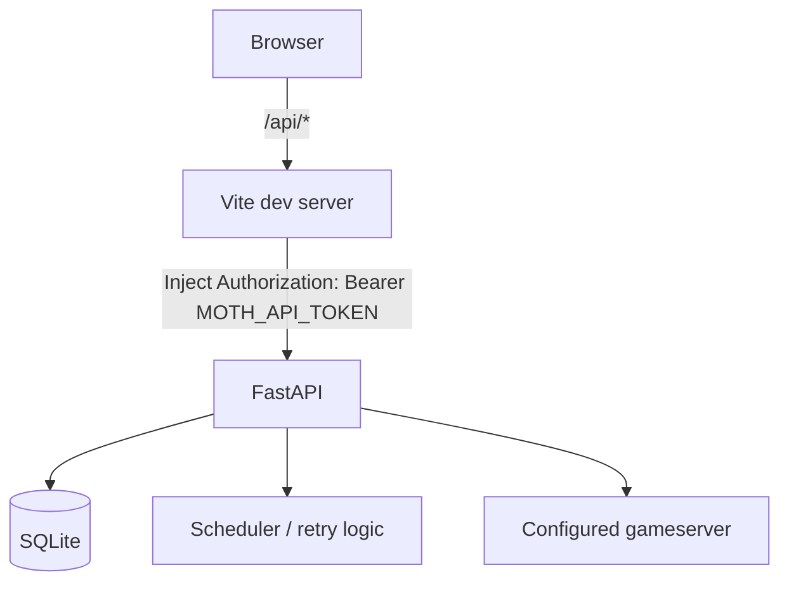

# MOTH Frontend

> Multi-Operator Transmission Hub  
> Mof carries the flags. MORI guards the nest.

The MOTH frontend is a React control surface for the MOTH flag submission service. It is designed for authorized CTF operations and focuses on operational visibility, manual submission, retry state, gameserver reachability, and recent activity.

The frontend deliberately follows the visual language of the wider MOTH / portfolio ecosystem instead of using a generic dashboard style. It uses dark purple and lavender, hard edges, terminal typography, outlined section titles, oversized ghost text, and a lightweight CRT treatment.

## Stack

The frontend currently uses:

- React
- TypeScript
- Vite
- plain CSS
- the existing FastAPI backend under `/api`

No CSS framework or component library is required.

Current frontend structure:

```text
frontend/
├── public/
│   └── moth-ambient.svg
├── src/
│   ├── api/
│   │   └── dashboard.ts
│   ├── components/
│   │   ├── ActivityTerminal.tsx
│   │   └── MoriFace.tsx
│   ├── activity-terminal.css
│   ├── crt.css
│   ├── dashboard-composition.css
│   ├── App.tsx
│   ├── index.css
│   └── main.tsx
├── vite.config.ts
└── package.json
```

## Development Architecture

During development, the browser talks to Vite on:

```text
http://localhost:5173
```

Vite proxies `/api` requests to FastAPI:

```text
http://127.0.0.1:8000
```

The development proxy injects the MOTH bearer token server-side:



The token is intentionally not exposed through a `VITE_*` environment variable, so it is not bundled into client-side JavaScript.

The token is loaded from the repository `.env` file by `vite.config.ts`.

## Running the Frontend

From the repository root:

```powershell
cd .\frontend
npm run dev
```

The development server is normally available at:

```text
http://localhost:5173
```

A production build can be checked with:

```powershell
npm run build
```

## Dashboard Endpoints

The frontend currently consumes four dashboard endpoints.

### Health

```text
GET /api/dashboard/health
```

Used for:

- overall MOTH health
- scheduler state
- retry queue state
- active leases
- retryable and due counts

Example:

```json
{
  "status": "healthy",
  "scheduler": {
    "state": "running",
    "running": true
  },
  "retry_queue": {
    "state": "clear",
    "retryable": 0,
    "due": 0,
    "active_leases": 0,
    "oldest_retry_at": null
  }
}
```

### Statistics

```text
GET /api/dashboard/stats
```

Used for:

- gameserver attempts
- accepted flags
- unique flags
- initial submissions
- retry attempts
- active leases
- due retries
- duplicate and invalid event counters
- stale retry results

### Recent Activity

```text
GET /api/dashboard/recent?limit=20
```

Used by the recent activity terminal.

The frontend displays operational event metadata. Plaintext flags are not returned by the dashboard event feed.

### Connectivity

```text
GET /api/dashboard/connectivity
```

Used for a safe reachability probe of the configured gameserver target.

The frontend displays:

- target host and port
- reachability
- greeting status
- greeting byte count when available
- latency

The connectivity probe does not submit a flag.

## Manual Flag Submission

The frontend can submit one flag through:

```text
POST /api/flags
```

The request generated by the frontend is equivalent to:

```json
{
  "flag": "FAUST_...",
  "source": "dashboard-manual"
}
```

The UI displays:

- status
- code
- message
- remembered state, when present

Example successful result:

```text
submitted
code=OK
remembered=true
```

Validation and authorization remain backend responsibilities.

## Live Polling

The dashboard automatically refreshes while the page is open.

Current behavior:

```text
health        about every 2 seconds
stats         about every 2 seconds
recent        about every 2 seconds
connectivity  every third cycle, about every 6 seconds
```

Polling is self-scheduling rather than implemented as a blind `setInterval()` loop.

A new polling cycle is scheduled only after the previous cycle has completed. This avoids request pileup if the backend becomes slow.

The polling effect also stops applying state updates after the component is unmounted.

## Visual Structure

The current frontend is intentionally not organized as a conventional card dashboard.

### Hero

The hero establishes the MOTH identity and keeps the large outlined typography used across the project.

### System Status

System state is presented as a ledger rather than a collection of KPI cards.

Current rows:

- MOTH API
- scheduler
- retry queue

MORI is treated as a separate visual presence instead of another statistic.

### Submission Statistics

Submission counters are displayed as large typographic values rather than boxed widgets.

Current counters:

- gameserver attempts
- accepted
- retries
- active leases

### Gameserver

Connectivity is presented as a terminal-like readout rather than a dashboard card.

### Manual Offering

Manual submission is treated as an operational command surface.

### Recent Activity

Recent events are rendered inside a dedicated terminal component inspired by the portfolio terminal design.

The terminal includes:

- square window controls
- purple grid
- scanlines
- scrollable event output
- terminal-style prompt and event formatting

## MORI

MORI is the security and operational presence in the frontend.

Current frontend face:

```text
₍^. .^₎⟆
```

The status text changes based on backend state.

Examples:

```text
approves. suspiciously.
watching the retry pile
staring at port 6666
noticed the scheduler sleeping
lost sight of the gameserver
```

The frontend does not infer backend state beyond telemetry returned by the API.

## Mof Sigils

The interface may use the established MOTH sigils:

```text
ཐི༏ཋྀ    ཐིཋྀ    ʚïɞ    ᖭི༏ᖫྀ

࿔‧ ֶָ֢˚˖𐦍˖˚ֶָ֢ ‧࿔

⁺‧₊˚ ཐི⋆♱⋆ཋྀ ˚₊‧⁺
```

These are decorative and do not carry operational meaning.

## Frontend Stress Validation

The current frontend path has been tested while:

- React live polling was active
- counters were updating continuously
- recent activity was rerendering
- the gameserver became unreachable
- retries accumulated
- the gameserver recovered
- retries drained
- new submissions continued during recovery
- a manual dashboard submission was performed during the run

The final backend state remained consistent after recovery.

Detailed results are recorded in `BENCHMARKS.md`.

## Design Principles

The frontend currently follows these project rules:

- no generic green hacker theme
- no rounded SaaS cards
- no glassmorphism
- no fake cyber-HUD corner decorations
- no unnecessary outer boxes around sections
- square or hard-edged controls
- purple and lavender accents
- terminal typography for operational metadata
- large editorial section typography
- borders only when an element is an actual object or control
- preserve the established MOTH and MORI visual language

The goal is not to look like a SOC product.

The goal is to look like MOTH.
