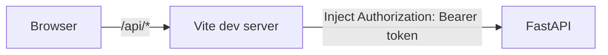

# MOTH Team Usage Guide

This is the internal operator and developer runbook for the TTZ FAUST CTF team.

It may contain operational details that should not be copied into the public GitHub repository before the competition.

For implementation details and concurrency rationale, use `docs/ARCHITECTURE.md`.

For frontend structure and visual behavior, use `docs/FRONTEND.md`.

For measured load results, use `docs/BENCHMARKS.md`.

For known boundaries and deployment gaps, use `docs/CURRENT_LIMITATIONS.md`.

```text
₍^. .^₎⟆
MORI checks you first.

ཐི༏ཋྀ
Then Mof takes the flag.
```

---

## Quick start

Activate the Python virtual environment from the repository root:

```powershell
.\.venv\Scripts\Activate.ps1
```

Run the backend tests before operational changes:

```powershell
pytest
```

Run the frontend tests and production build check:

```powershell
cd .\frontend
npm test
npm run build
cd ..
```

Start MOTH for local development:

```powershell
uvicorn app.main:app --reload
```

For quieter local stress testing:

```powershell
uvicorn app.main:app --no-access-log --log-level warning
```

Start the frontend in a separate terminal:

```powershell
cd .\frontend
npm run dev
```

The development dashboard is then served by Vite, normally at:

```text
http://localhost:5173
```

For a full local end-to-end session, use separate terminals for:

1. the fake gameserver when needed
2. the FastAPI backend
3. the Vite frontend

Do not use development reload mode or the Vite development server for final competition deployment unless that choice is intentional and reviewed.

---

## Configuration

Core environment variables:

```text
MOTH_DB_KEY
MOTH_API_TOKEN
MOTH_SUBMISSION_HOST
MOTH_SUBMISSION_PORT
MOTH_SUBMISSION_TIMEOUT
```

Optional database override:

```text
MOTH_DB_PATH
```

Local development may use `.env`.

Never commit `.env` or real competition secrets.

### Example local `.env`

```text
MOTH_DB_KEY=<local-development-key>
MOTH_API_TOKEN=<local-development-token>
MOTH_SUBMISSION_HOST=127.0.0.1
MOTH_SUBMISSION_PORT=6666
MOTH_SUBMISSION_TIMEOUT=5.0
```

Competition values belong in the deployment environment.

### Frontend development configuration

The Vite development server reads the repository-root environment configuration and requires `MOTH_API_TOKEN` so it can authenticate proxied `/api` requests to FastAPI.

The token is injected **server-side by the Vite proxy**.

Do not rename it to a `VITE_*` variable. Variables with that prefix are exposed to browser code by Vite.

The current local development path is:



This is a development convenience, not the final competition secret-distribution model.

---

## Generate an API token

Generate locally:

```powershell
python -c "import secrets; print(secrets.token_urlsafe(32))"
```

Store it as:

```text
MOTH_API_TOKEN=<generated-token>
```

Use separate key material for the database encryption key.

Do not reuse the API token as `MOTH_DB_KEY`.

Do not give the database key to exploit scripts that only need API access.

---

## Authentication

Protected requests use:

```http
Authorization: Bearer <MOTH_API_TOKEN>
```

Expected authentication failures:

| Situation | Expected HTTP status |
| --- | ---: |
| missing token | 401 |
| wrong token | 401 |
| malformed authorization | 401 |
| server has no API token configured | 503 |

MORI fails closed.

### Browser dashboard authentication in development

The React application does not embed `MOTH_API_TOKEN` into the browser bundle.

For local development:

1. the browser requests `/api/...` from Vite
2. Vite forwards the request to FastAPI
3. Vite adds `Authorization: Bearer <MOTH_API_TOKEN>` on the server side

Direct exploit scripts and manual API clients still send their own bearer token.

Do not treat this Vite proxy arrangement as a production authentication architecture.

---

## Load the local API token in PowerShell

```powershell
$token = (
    Get-Content .env |
    Where-Object {
        $_ -like "MOTH_API_TOKEN=*"
    }
).Split("=", 2)[1]
```

Avoid printing the token unnecessarily.

---

## Submit one flag manually

Create a request body:

```powershell
$body = @{
    flag = "FAUST_AAAAAAAAAAAAAAAAAAAAAAAAAAAAAAAA"
    service = "manual-test"
    source = "operator"
} | ConvertTo-Json
```

Submit it:

```powershell
Invoke-RestMethod `
    -Uri "http://127.0.0.1:8000/api/flags" `
    -Method Post `
    -ContentType "application/json" `
    -Headers @{
        Authorization = "Bearer $token"
    } `
    -Body $body
```

---

## Single-flag responses

### Accepted

```json
{
  "status": "submitted",
  "code": "OK",
  "message": "accepted",
  "remembered": true
}
```

### Local terminal duplicate

```json
{
  "status": "duplicate",
  "code": "LOCAL",
  "message": "mof has already seen this offering",
  "remembered": true
}
```

Do not submit the same terminal flag again.

### Existing retryable flag

```json
{
  "status": "queued",
  "code": "LOCAL_RETRY",
  "message": "mof already has this offering queued for retry",
  "remembered": false
}
```

The retry scheduler already owns the work.

### Same flag currently in flight

```json
{
  "status": "in_flight",
  "code": "IN_FLIGHT",
  "message": "MORI is already guarding this offering while mof submits it",
  "remembered": false
}
```

Do not race the existing request.

### Local overload

Expected:

```text
503 Service Unavailable
Retry-After: 1
```

Wait and retry later.

### Gameserver connection failure

Expected:

```text
502 Bad Gateway
```

The attempt remains retryable.

### Gameserver timeout

Expected:

```text
504 Gateway Timeout
```

The attempt remains retryable.

---

## Exploit integration

Exploit code should perform a small authenticated HTTP request and let MOTH own submission state.

```python
import os

import httpx


MOTH_URL = os.environ["MOTH_URL"]
MOTH_API_TOKEN = os.environ["MOTH_API_TOKEN"]


def submit_flag(
    flag: str,
    service: str | None = None,
    source: str | None = None,
) -> dict:
    response = httpx.post(
        f"{MOTH_URL}/api/flags",
        headers={
            "Authorization": (
                f"Bearer {MOTH_API_TOKEN}"
            ),
        },
        json={
            "flag": flag,
            "service": service,
            "source": source,
        },
        timeout=10.0,
    )

    if response.status_code == 503:
        retry_after = response.headers.get(
            "Retry-After",
            "1",
        )
        raise RuntimeError(
            "MOTH temporarily unavailable; "
            f"retry after {retry_after} second(s)"
        )

    response.raise_for_status()
    return response.json()
```

Do not hardcode API tokens into exploit repositories.

---

## Batch submission

Endpoint:

```http
POST /api/flags/batch
```

A batch accepts at most 500 flags.

Example:

```powershell
$batch = @{
    flags = @(
        "FAUST_AAAAAAAAAAAAAAAAAAAAAAAAAAAAAAAA",
        "FAUST_BBBBBBBBBBBBBBBBBBBBBBBBBBBBBBBB"
    )
    service = "achat"
    source = "exploit-achat"
} | ConvertTo-Json

Invoke-RestMethod `
    -Uri "http://127.0.0.1:8000/api/flags/batch" `
    -Method Post `
    -ContentType "application/json" `
    -Headers @{
        Authorization = "Bearer $token"
    } `
    -Body $batch
```

MOTH validates each item independently, deduplicates repeated entries inside the request, preserves result order, and does not return plaintext flags in the result objects.

### Example summary

```json
{
  "received": 10,
  "accepted": 7,
  "duplicate": 1,
  "terminal_other": 0,
  "retryable": 1,
  "invalid": 0,
  "in_flight": 0,
  "overloaded": 1
}
```

### Summary fields

| Field | Meaning |
| --- | --- |
| `accepted` | gameserver returned `OK` |
| `duplicate` | local, batch-local, or gameserver duplicate |
| `terminal_other` | terminal result other than `OK` or `DUP` |
| `retryable` | unfinished work remains retryable |
| `invalid` | input failed FAUST flag validation |
| `in_flight` | another request currently owns the same flag |
| `overloaded` | MOTH had no available submission capacity |

---

## Supported flag shape

```text
FAUST_[A-Za-z0-9/+]{32}
```

Example:

```text
FAUST_AAAAAAAAAAAAAAAAAAAAAAAAAAAAAAAA
```

---

## Dashboard access

Dashboard routes use the same bearer token.

### Browser control surface

Start the backend and then the Vite frontend:

```powershell
uvicorn app.main:app --reload
```

In another terminal:

```powershell
cd .\frontend
npm run dev
```

Open the Vite URL shown in the terminal, normally:

```text
http://localhost:5173
```

The control surface shows:

* MOTH API health
* scheduler state
* retry-queue state
* submission statistics
* gameserver connectivity
* recent operational activity
* manual flag offering

Health, statistics, and recent activity refresh automatically. Gameserver connectivity is sampled less frequently so routine UI polling does not open a TCP probe on every refresh.

Manual submission through the dashboard uses `source=dashboard-manual`.

### Direct dashboard API access

### Statistics

```http
GET /api/dashboard/stats
```

```powershell
Invoke-RestMethod `
    -Uri "http://127.0.0.1:8000/api/dashboard/stats" `
    -Headers @{
        Authorization = "Bearer $token"
    }
```

### Recent activity

```http
GET /api/dashboard/recent?limit=20
```

```powershell
Invoke-RestMethod `
    -Uri "http://127.0.0.1:8000/api/dashboard/recent?limit=20" `
    -Headers @{
        Authorization = "Bearer $token"
    }
```

Recent activity should not be treated as a flag viewer.

### Operational health

```http
GET /api/dashboard/health
```

Use this for scheduler and retry-queue state.

### Gameserver connectivity

```http
GET /api/dashboard/connectivity
```

Use this only when an explicit live connectivity check is wanted.

---

## Basic application health

```http
GET /api/health
```

Typical local response:

```json
{
  "status": "alive",
  "mori": "watching",
  "moth": "awake"
}
```

---

## Frontend tests

The frontend uses Vitest with React Testing Library.

Run the suite from `frontend/`:

```powershell
npm test
```

Watch mode is available during development:

```powershell
npm run test:watch
```

The automated frontend coverage checks behavior such as:

* initial operational state rendering
* manual submission
* rejection of an empty manual offering
* post-submission refresh
* continued polling
* gameserver-down rendering

Then verify the production build:

```powershell
npm run build
```

Frontend tests do not replace the live browser, outage, and recovery rehearsals.

---

## Local fake gameserver

Start the provided fake server:

```powershell
python -m tools.fake_gameserver --delay-ms 0
```

Simulate a slower backend:

```powershell
python -m tools.fake_gameserver --delay-ms 1000
```

The fake server is for local development only.

Do not point local stress tooling at competition infrastructure.

---

## Same-flag race test

The race tool starts its own fake gameserver.

Stop any separately running fake server on port `6666` before running it.

```powershell
python -m tools.race_same_flag
```

Healthy output should show one gameserver submission for one logical flag even when many requests race.

If the tool reports more than one gameserver submission, stop and investigate before competition use.

---

## Local stress testing

Use a disposable database:

```powershell
$env:MOTH_DB_PATH = "stress_moth.db"
```

Start MOTH quietly:

```powershell
uvicorn app.main:app --no-access-log --log-level warning
```

### Health pressure

```powershell
python -m tools.stress_moth health `
    --requests 2000 `
    --concurrency 100
```

### Unique single-flag pressure

```powershell
python -m tools.stress_moth single `
    --requests 500 `
    --concurrency 100
```

Controlled `503` responses are valid overload behavior.

Unexpected transport errors or HTTP `500` responses require investigation.

### Batch pressure

```powershell
python -m tools.stress_moth batch `
    --requests 4 `
    --concurrency 4 `
    --batch-size 250
```

---

## Stress database cleanup

Stop MOTH first.

Then remove the disposable database:

```powershell
Remove-Item .\stress_moth.db* `
    -ErrorAction SilentlyContinue
```

Remove the environment override:

```powershell
Remove-Item Env:MOTH_DB_PATH `
    -ErrorAction SilentlyContinue
```

Do not delete the real competition database.

---

## Port `6666` already in use

If the race tool reports Windows socket error `10048`, inspect the listener:

```powershell
Get-NetTCPConnection `
    -LocalPort 6666 `
    -ErrorAction SilentlyContinue
```

Inspect the owning process before terminating anything:

```powershell
Get-Process -Id <PID>
```

Only stop the process after confirming it is the disposable local fake gameserver.

---

## Competition deployment worksheet

Fill these only after deployment design is finalized:

```text
MOTH host:
TODO

MOTH port:
TODO

Submission backend host:
TODO

Submission backend port:
TODO

Transport:
TODO

Frontend serving method:
TODO

Browser-to-MOTH authentication boundary:
TODO

Application process count:
TODO

Reverse proxy:
TODO

Startup method:
TODO

Restart policy:
TODO

Log location:
TODO

Database backup location:
TODO
```

The architecture document explains why process count and network controls matter. This guide only records the chosen operational values.

---

## Team token distribution

Final method:

```text
TODO
```

Requirements:

* never publish tokens
* never place tokens in screenshots
* never embed tokens directly in exploit source
* never reuse `MOTH_DB_KEY` as the API token
* rotate the API token if exposure is suspected

---

## Competition-day startup checklist

```text
[ ] Correct private branch checked out
[ ] Working tree clean
[ ] Latest TTZ changes pulled
[ ] Backend test suite passing
[ ] Frontend test suite passing
[ ] Frontend production build succeeds
[ ] MOTH_DB_KEY configured
[ ] MOTH_API_TOKEN configured
[ ] Submission host configured
[ ] Submission port configured
[ ] Submission timeout configured
[ ] Correct database path confirmed
[ ] Correct network path available
[ ] MOTH started
[ ] Basic health checked
[ ] Authentication checked
[ ] Dashboard health checked
[ ] Frontend control surface checked if deployed
[ ] Gameserver connectivity checked
[ ] Database writable
[ ] Retry scheduler running
[ ] Logs visible
[ ] No secrets visible in logs
[ ] Team knows the active MOTH endpoint
[ ] Team knows how to handle Retry-After
```

---

## Competition-day sanity check

Before teammates begin submitting flags:

1. verify MOTH is running
2. verify requests without credentials are rejected
3. verify the real token reaches flag validation
4. verify dashboard health
5. verify gameserver connectivity explicitly
6. verify the database is writable
7. verify the retry scheduler is alive
8. verify logs do not expose secrets
9. verify exploit scripts use runtime credentials
10. verify teammates know the active endpoint and overload behavior

---

## Troubleshooting

### `401`

Check:

* bearer token present
* token value correct
* Authorization header well formed

### `422`

Check:

* flag shape
* JSON structure
* batch length

### `502`

Check:

* gameserver availability
* routing
* configured host
* configured port

The attempt remains retryable.

### `503`

Possible causes include:

* server authentication configuration missing
* submission capacity exhausted
* stale initial claim result

If a `Retry-After` header is present, respect it.

### `504`

The gameserver did not answer before the configured timeout.

The attempt remains retryable.

### `LOCAL`

MOTH already remembers the flag as terminal.

### `LOCAL_RETRY`

MOTH already owns the flag as retryable work.

### `IN_FLIGHT`

Another initial request currently owns the same flag.

### `OVERLOADED`

MOTH has no available submission capacity.

Wait and retry.

### `MOTH_API_TOKEN is missing`

Server authentication configuration is incomplete.

### `MOTH_DB_KEY is missing`

Database cryptographic configuration is incomplete.

Do not casually replace the key if existing encrypted state must remain readable.

### `database is locked`

Repeated lock errors require investigation.

Check:

* current load
* application process count
* unexpected competing writers
* database path
* long-running local tools

Do not respond by blindly increasing concurrency.

### Frontend loads but API data does not

Check:

* FastAPI is running on the expected local port
* the Vite proxy target matches the backend
* the repository-root environment contains `MOTH_API_TOKEN`
* the backend is using the same token
* the token was not moved into a `VITE_*` variable
* the browser is using the Vite development URL rather than bypassing the configured proxy

### Frontend tests fail

Run the failing test directly through Vitest output and fix the assertion or behavior that actually failed.

Prefer semantic queries such as labels, roles, and scoped elements over assertions that depend on incidental duplicated text.

After a test fix, rerun:

```powershell
npm test
npm run build
```

---

## Logs and sensitive data

Do not log or publish:

```text
MOTH_API_TOKEN
MOTH_DB_KEY
Authorization headers
private SSH keys
plaintext captured flags
```

Treat captured flags as sensitive competition data.

---

## Database handling

Default local database:

```text
moth.db
```

Optional override:

```text
MOTH_DB_PATH
```

Do not commit database files.

Do not run load tests against the competition database.

Do not delete or rotate cryptographic state during competition unless the failure is understood.

---

## Git workflow

Active private remote:

```text
ttz
```

Public snapshot remote:

```text
origin
```

Before coding:

```powershell
git status
git pull
```

After backend or shared changes:

```powershell
pytest
```

After frontend changes:

```powershell
cd .\frontend
npm test
npm run build
cd ..
```

Then inspect the repository:

```powershell
git diff --check
git status
```

Stage only intended files, commit, then push normally to the tracked TTZ branch.

Do not casually run:

```powershell
git push origin main
```

during private competition development.

---

## Signed commits

Verify repository signing configuration:

```powershell
git config --get gpg.format
git config --get user.signingkey
git config --get commit.gpgsign
```

Expected shape:

```text
ssh
<SSH signing key>
true
```

Never share the private signing key.

---

## Publishing after the competition

Review private history before publishing anything back to the public repository.

Possible sanitized material includes:

* architecture
* hardening results
* failure modes
* operational lessons
* sanitized tooling
* deployment retrospective

```text
₍^. .^₎⟆

MORI says:
review before publishing.
```

---

## Emergency rule

If MOTH behavior becomes unclear during competition:

```text
stop sending new traffic
check dashboard health
check logs
check gameserver connectivity
check configuration
check retry state
check database state
check with the team
```

Do not blindly:

```text
restart repeatedly
rotate encryption keys
delete the database
edit retry state
increase process count
increase concurrency
```

without understanding what failed.

Mof is small.

Please do not panic the moth.

```text
ཐི༏ཋྀ
```
